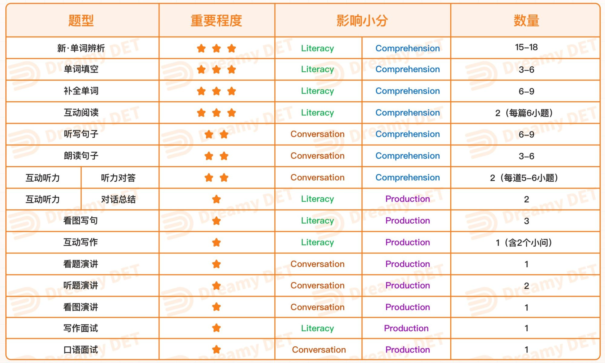

<!-- truncate -->

## Literacy

### 填空
要会猜：熟记特定字母开头的，不超过4个字母的单词
of, or, on, ok
all, are, ask, any, and, act, ant
what,  when, well, were, went, with, will, warm, ways, wage, wall, work

前缀、后缀、名词的复数形式、动词的变位、形容词的比较级
变位都算正确的

后缀对词干词性有要求
形容词可以加ly，动词不可以加，形容词的比较级不能加
名词+ly
1指人：brotherly/manly/friendly/scholarly/ghostly
2指时间:monthly/weekly/hourly/quarterly/yearly掌握常见前缀的变体
### 反义词
in
in在b\m\p之前，变成im
l之前，变成il
r之前，变成ir
其他情况不变
错误实例inregulate\ inpassionate\inbibe\inmutable

### 描述
The photograph depicts a/an/two/some/+adj.+n.+doing  sth.+adv.+介词短语
depict v.描述、描绘、画

### 朗读句子
用准备时间顺一遍生词，连续、失爆、浊化、轻重音

## Production
production比起口语更偏重写作，而conversation会更偏重口语。而写作会很注重C级词汇的使用。

### 1. 看图写作

考试中会遇到三道看图写作题，三道连出，考试时一般从第四道题或者第五道题出现，做好心里准备。以下有三个模版，**每道题的开头分别使用一个模版**，背熟后去登登上练习套模版。

- **We can see in this intriguing and quaint picture that there are X(数字) vivacious people doing sth. ...**
- **It can be manifestly seen in this fabulous snapshot that ...**
- **As depicted in this engrossing image, ...**

**图中有人，开头模版句先描述人物在干什么。**

人物：小孩 - cunning/lovable kid

男性 - muscular/personable man

女性 - winsome woman

妈妈 - affectionate mother

老人 - the grizzled elderly

工人 - wholehearted worker

黑人 - dark-skinned

动作：笑 - is grinning cheerfully

哭 - is wailing sorrowfully

认真工作 - is working attentively

套话 - is lying/standing soundlessly on the ground

**写完开头句后再写一句或两句短句即可**。一般根据图片内容选择性去写后面的句子，具体描述一下这个人的行为/或者这个人的衣服/或者这个人看上去怎么样It seems... 这个人很愉悦feel blissful，这个人很伤心feel apprehensive，这个人很累is exhausted
衣物：is naked to the waist 半裸
uniform 制服（厨师/警卫/保安/工人）
singlet （老头）汗衫
hood 头巾
jumper 套头卫衣

**图中只有物，开头模版句描述一下物品，接着用一两句描述一下环境或天气**，可以It seems... 很安静/很美/很危险hazardous，也可以It seems that it is a sunlit and radiant/chilly and frigid/hazy and overcast day。描述天气的句子是我从别人攻略那看来的，不过我自己不常用，我更喜欢用简单词继续描述物品和环境，如果考试来不及思考就直接放一句套话：It is (not) tranquil with serenity.

物品：bench
wooden table
cliff 悬崖
mattress 床垫
amusement park 游乐场
sky wheel 摩天轮
pram 婴儿车
hay 干草
translucent roofs
parade 游行
lawn 草地
concrete house
telescope 望远镜

这些词都是我三天内刷题时自己记录积累的不熟单词，你们自己做题时也可以记录一下。

### 2. 小作文

**There is an ongoing dispute about xxx(改写题目). From my perspective, two momentous factors can explain why I do maintain the belief that 你的观点. There are several quintessential instances and reasons involved thereof.**

**The manifest sentiment coincides with my standpoint is that 观点1+案例(for instance)**

**Additionally, advocates utterly concede that 观点2 + 案例(for example)**

**Finally, we can arrive at the undeniable conclusion that it is indisputable for people to+ 重复第一段中的观点.**

描述类和议论类小作文都可以使用此模版，但描述类在套模版前需要先回答一下题目的问题。

考试前一定要把模版敲熟，要做到不需要思考就能把模版打出来，否则会不够时间写你的观点。小作文的字数会影响你的分数，所以尽可能多写一点，并留出一小部分时间检查一下有没有敲错的词。我在平时刷题的时候就练习到能写完140+的词，考试的时候即使有些慌忙也能打到130-140的词。如果英语基础一般，来不及或没有把握正确改写题目，亲测套模版的时候直接把题目原句抄上去也不会影响分数的。

小作文的万能词句：（用于表达观点时增加C级词汇量）

**It will exert a profound effect on people's life.**

**It is commonly acknowledged that..**

merits and demerits 用于替换advantages and disadvantages

an extraordinary solution

## Conversation
### 1. 小口语（看题演讲/听题演讲）

亲测小口语C级词汇其实没有很重要，只要嘴巴不停地讲就行，重复题目也没关系，说一些没什么意义的话也可以，不必有逻辑。但有两点很重要，一是乱讲也要**和题目相关**（否则会不认证），二是尽量说到倒计时结束5s之内，三是尽量**不要有卡壳**（否则会非常影响分数）

登登把小口语分为描述类，对比类和解决类，其实我觉得不必，像我只备考了三天就算背了三种模版也来不及练怎么根据题型去套各种模版。所以我亲测了一下，只需要背一种模版，然后根据题目生搬硬套就行，反正多邻国也不要求什么逻辑，审核的考官也只听到你讲的话题和题目问的一致就行。

**Well, I’d like to talk about** XXX, **which** is XXX. **I want to introduce it to you because it is such a** **fantastic/terrible**XXX/topic.

**Before I** ..., **I used to think that** ... **That was why I had never paid my attention to this topic before.**

**Unexpectedly, I randomly** ... **about XX months ago, which changed my** **mind.**

**开始你的内容 (**Nowadays, a considerable amount of people are beginning to believe that ___ is/are significant.**) ...**

**It provided me an opportunity** **to** **expose** **myself to** XXX **and changed my point of view on certain things that helps me expand** **my horizon.**

**Therefore, that’s why** XXX. **就可以结束了**

**（如果时间不够：I’m very glad to introduce it to you. If you have some free time, you can try it. I guess you will get something unexpected.）**

这原本就是描述类的模版，所以描述类的题就很好套。

如果有时间的话可以背一下另一个针对对比类题目的模版，如果没时间背，用以上的模版也可以做对比类题目。

**When it comes to (whether A is better than B / what are the merits and demerits of), people have different opinions. I personally believe that (A is better than B / there are more advantages than disadvantage) ...**

**Admittedly,** **it is commonly acknowledged that** ..., **because** ...

**However,** **it should be pointed out that** ...

**In addition,** **it is a fact that** ...

**Overall,** **it is obvious that** **(A is better than B / there are more advantages than disadvantage) ...**

如果听题演讲没听懂题目问什么，但又不想让考官觉得你在胡说八道乱套模版的话，你可以说一句**Sorry, I'm not sure if I understand the exact meaning of this question, but I think it is asking me to talk about ...**  亲测这句话不会影响分数，我考试的时候虽然听懂了题目，但不是很确定有没有理解对，我就说了这句话。

### 2. 看图演讲

看图演讲和看图写句的区别是，看图演讲要更细致得描述图片，也要用更多套话去凑满时间。

模版：

**This** (black and white) **picture depicts a fabulous situation outdoors/indoors + 地点**

**There are several quintessential items involved thereof. For example, we can see there are + 图中的物品 (adj. + n.) at the top / on the right or left / at the bottom / in the background or foreground / in the middle.**

**如果图里有人物 - Additionally, we can see there is/are+ 人物 who is (eg. talking to others, chatting with her friend，lying on the grass). He/she/they+has/have 外貌细节（头发+眼镜+胡子+肤色）Plus, He /She/They is/ are ... wearing 什么衣服 + 什么配饰（手表+头巾+围巾+帽子）According to their facial expression, I could speculate that they feel + 心情词 (blissful/apprehensive)**

**如果时间还没凑满就说，时间快结束了就不要说了 - This engrossing picture reminds me of my own memorable experience. In retrospect, ... +经历 (描述与题目相关的经历，比如说我来过类似的地方/我做过类似的活动) during puberty / in childhood.**

**In brief, this image is very informative and provides me lots of useful information / evokes my recollection of (my puberty / my childhood).**

看图演讲把模版背熟基本就没什么问题了

## Templates
### ***偏描述类口语开头***

**Speaking of (题目的中心), I feel like I have to talk about (题目), which is popular on the internet.**

**尽可能回答部分问题**

**To be honest, before…, I used to think that (否定题目现象). Therefore, I didn’t know why people were keen to …, which was the reason why I had never paid attention to this topic before. Unexpectedly, by chance, I …**

**From that day on, I have been (doing xxx) every day. Admittedly, it sounds a little bit exaggerated or even eccentric, but it is the truth. Because there was one day that I didn’t (do xxx) before sleep which made me feel wretched, frustrated, and disappointed. So it becomes necessary for me to (do xxx) regularly.**

### ***偏对比类口语开头***

**About (题目), different people have entirely dissimilar opinions.**

**Hence, there is an ongoing dispute about (题目) on the internet, which could be vitally problematic. However, I deem that …. for the following reasons and instances.**

**尽可能回答部分问题**

**To be honest, before…, I used to think that (题目) is of little significance. Hence, I haven’t thought about it until Irealized that it exerts a profound impact on people’s lives.**

### **开头说完了就开始说意义，任选几句说满时间：**

**It provided me an opportunity to expose myself to…, which helps me broaden my horizon. This enables me to change my point of view on certain things, thereby exerting a profound impact on cultivating my xx skills.** **Had it not been for this experience, I would not have become such a versatile person today.**

**意义中的"I"可以换成“人们””家长“等等。**

**2022.12.12更新：除了上述两点之外我还准备过一个通用的讲人的例子。**

比如说我准备了Paul Volcker调整货币供给（实质上提高利率）拯救美国经济于滞涨的例子，这个故事的好处在于题目问 great person / notorious person都能用这个例子，因为这个举措长期上体现了他有远见有魄力，但短期内也冲击经济造成了失业率飙升。

### **小作文**

**先回答问题**

**About (题目), different people have entirely dissimilar opinions. Hence, there is an ongoing dispute about… Apparently, this controversy about … could be vitally problematic. From my perspective, elaborated by two momentous factors, I deem that (观点). There are several quintessential instances and reasons involved thereof.**

**The explicit sentiment that coincides with my standpoint is that …**

**Additionally, advocates utterly concede that …**

## Reference:
[https://www.zhihu.com/question/389160562/answer/2361065176](https://www.zhihu.com/question/389160562/answer/2361065176)
[https://zhuanlan.zhihu.com/p/536211922](https://zhuanlan.zhihu.com/p/536211922) -->
