# Writing
## Integrated Writing

### Template1
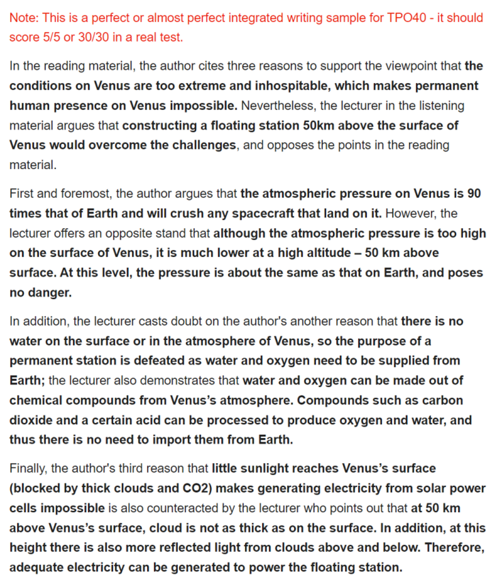

<!-- truncate -->
The reading and the lecture are about …The author in the reading material cites three reasons to support the viewpoint that … In the listening material, nevertheless, the lecturer argues that … and opposes all those theories in the reading material.

First, the author suggests that … However, the lecturer offers an opposite stand that…

In addition, in contrast to the author’s another reason that … the lecturer contends that…

Finally, the lecturer cast doubt on the last reason in the reading that … since … he also demonstrates that …

### Template2
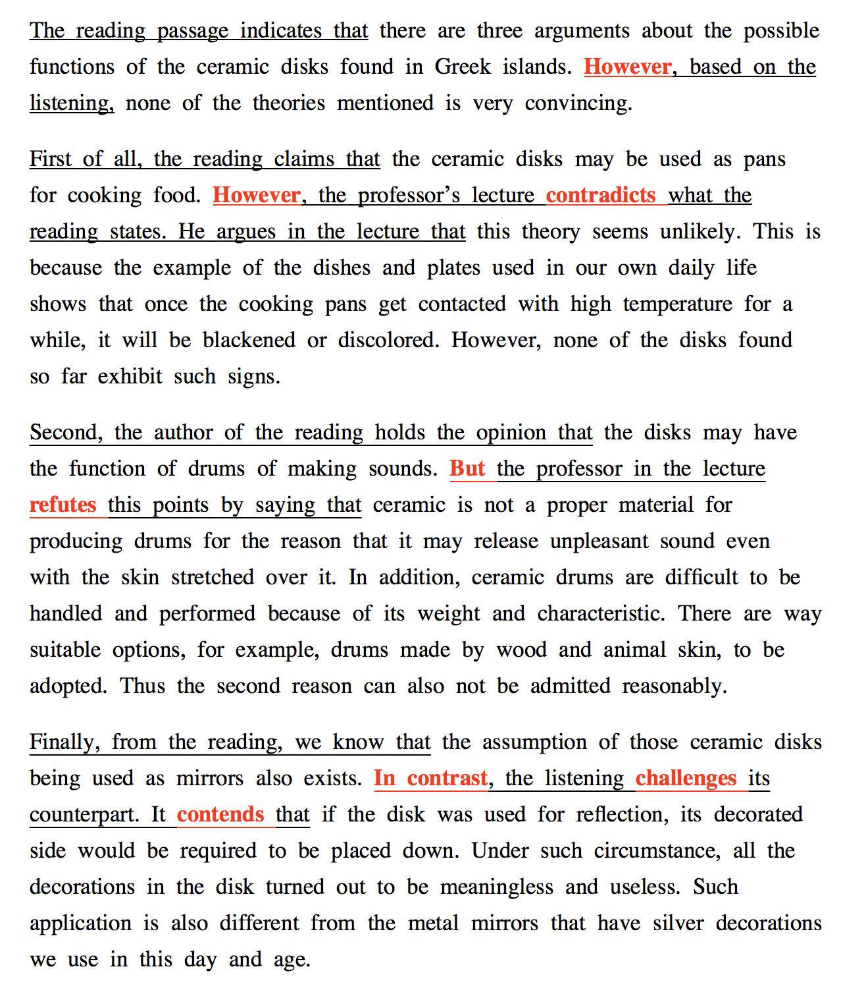
The passage and the accompanying lecture discuss divergent perspectives on [topic]. While the author presents three compelling arguments in favor of [main viewpoint], the lecturer vehemently opposes these assertions, offering a counterargument that challenges each point raised in the reading material.

Initially, the author posits that [first reason]. However, the lecturer presents a contrasting viewpoint, asserting that [counterargument].

Moreover, in direct contrast to the author's assertion regarding [second reason], the lecturer contends that [opposing viewpoint], providing compelling evidence to support this assertion.

Lastly, the lecturer scrutinizes the final argument proposed in the reading, which suggests that [third reason]. However, the lecturer raises doubts about this claim by highlighting [counterpoint]. Furthermore, the lecturer substantiates their argument by demonstrating [additional evidence or reasoning].

Overall, while the reading material puts forth a convincing argument, the lecture effectively challenges each point raised, offering a more nuanced perspective on [topic].

## Academic Discussion

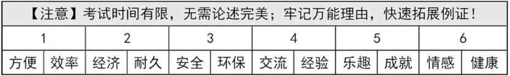

### **Technology** 

***Positive impact***
- Makes our life easier
- Technological advancements
- Connect people all around the world >> facilitate globalization
- Lead to the development of …
- There’s been a breakthrough in …
- Accomplish things we could hardly imagine in the past, e.g.,……
    
***Negative impact***
- Increased screen time leads to health concerns (poor eyesight, chronic neck and back problems, obesity, sleep problems)
- Instant rewards >> distractions, temptations, addiction
- Triggers body image anxiety

### **Relationship** 

- Strengthen/deepen the bonds between …
- Expand interpersonal connections;
- Practice communicative/social skills;
- Exchange perspectives/ideas/thoughts;
- Promote critical thinking and problem-solving ability;

### **Learning**

- Enrich knowledge
- Acquire new skills such as …
- Broaden horizon
- Accumulate life/working experience
- Discover new interests
- free of distractions/temptations
- become more concentrated/focused on…

### **Exercising**

- improve health condition
- Exercise muscles and build up strengths
- Boost respiratory functions
- Promote cardiovascular circulation/metabolism
- Reinforce immune system
- Enhance flexibility, balance and coordination
- Get rid of chronic diseases like obesity, high blood pressure/hypertension, and diabetes
- Keep fit/keep a good figure/shape

### **Traveling**

- Gain an insight into other cultures/traditions/customs/conventions
- Become more open-minded
- Establish a global view
- Enhance language proficiency
- Get rid of stereotypes and over-generalizations
- Embrace cultural differences

### **Money**

- Earn money for tuition fee/living expense
- Relieve/alleviate family burden
- It is cost-effective
- have a tight budget
- Price is always the main factor that drives/influences people’s decision
- Financial concerns always lead to all kinds of mental sufferings.

### **Relaxation & Mental Well-being**

- Escape from/release academic pressure
- Wind down/ unwind oneself
- Get plenty of rest and relaxation
- Have a fresher mind
- Feel more motivated to study
- Restore energy, recharge oneself
- Mentally-draining, under tremendous pressure
- Suffered from burn-out
- feel overwhelmed/exhausted
- Pull myself together
- Take the edge off;
    - e.g., It’s just something to take the edge off.
    - At sunset in the islands, a nice cool breeze takes the edge off the hot weather

### Phrases & Sentences
The Great Depression
New Deal enacted by Roosevelt, Hoover Dam
Layman’s eye
Virtuous cycle

Not by arguing, but by trying. ——Francis Bacon
There are a thousand Hamlets in a thousand people's eyes.

### Templates (130~150 words)
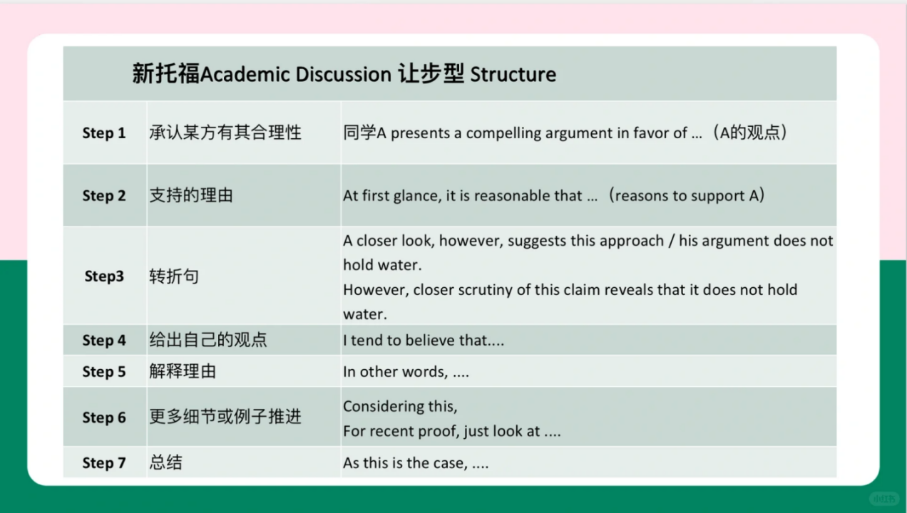

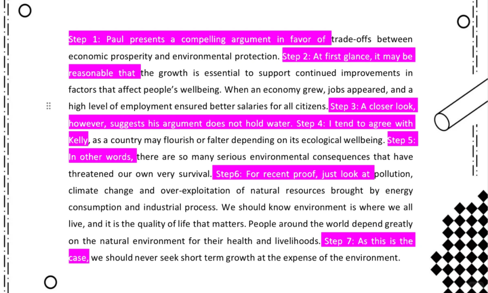

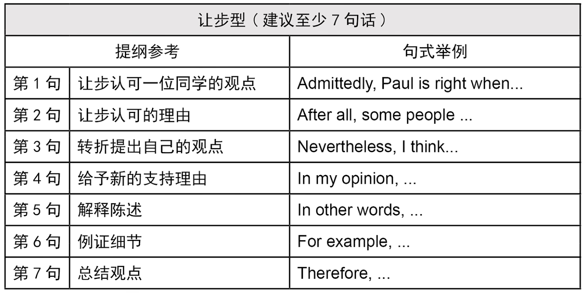

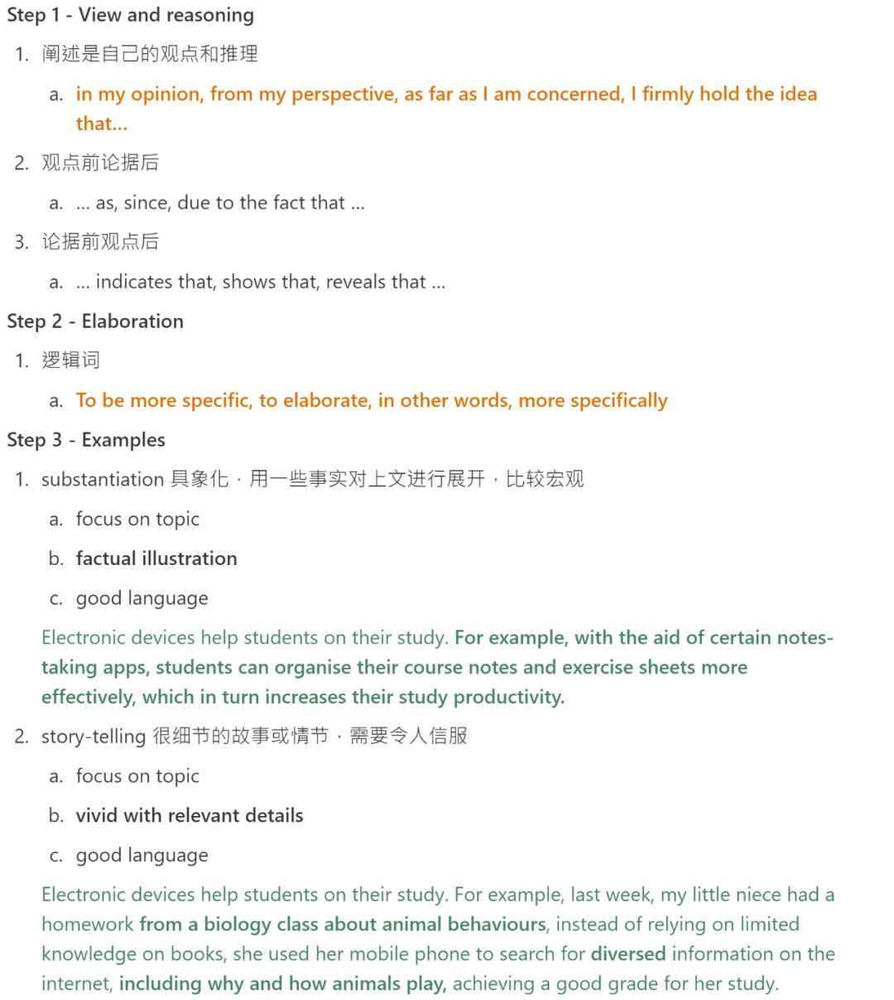

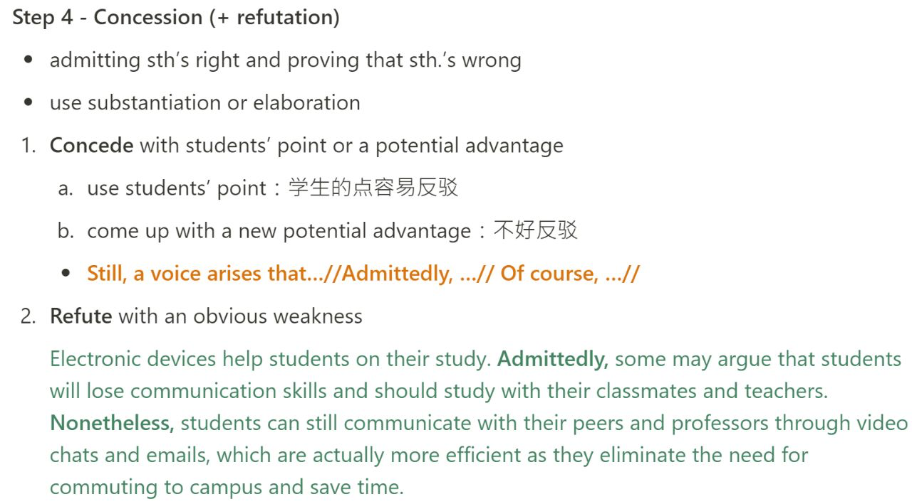

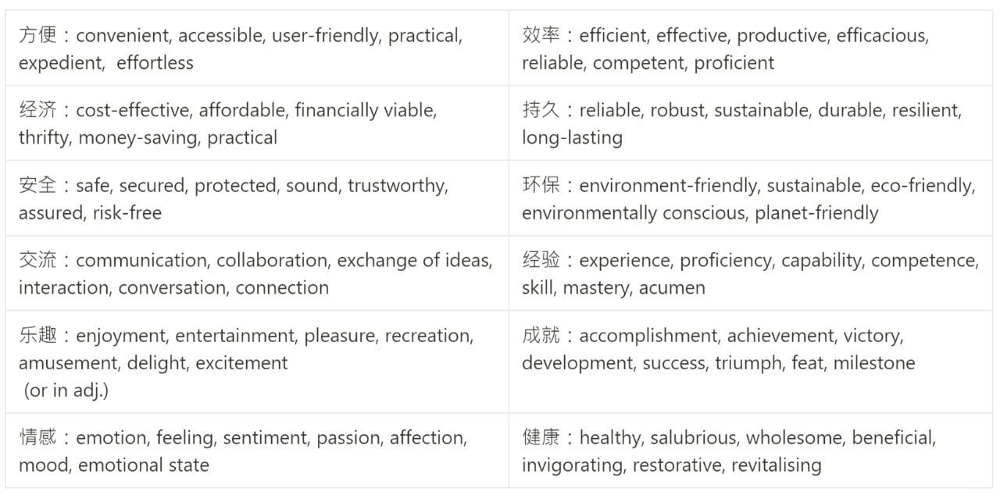

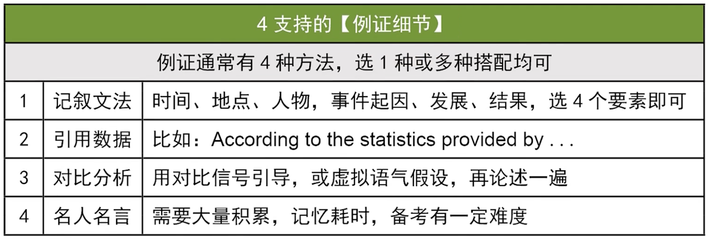

[1] I am deeply convinced of …

[2] I completely align with Sam's belief that …

[3] Beyond this, …

[4] 

[5] While Sarah highlighted the …, she overlooked the …

[6] 

[7] In summary, my firm belief is that …

### Examples

[1] From my perspective, students should be given grades. [2] Grades, when accompanied by constructive feedback, offer valuable insights into a student’s performance. [3] This feedback is crucial for learning and development, as it guides students in understanding their mistakes and learning from them. [4] It also provides a roadmap for both students and teachers to focus their efforts more effectively. By highlighting strengths and weaknesses, grades combined with feedback can significantly enhance a student’s learning experience.

[5] While it's true that grades can foster competition, this isn't inherently negative. [6] Competition, when framed positively, can motivate students to strive for excellence and can prepare them for real-world scenarios where performance is often measured against peers. The key is to balance this with collaborative learning opportunities that emphasize teamwork and collective achievement, showing that individual success does not have to come at the expense of others.
[7] In summary, assigning grades to students does more good than harm.

[1] I strongly advocate for the imposition of taxes on unhealthy products. [2] I completely align with Sam's belief that such taxes could significantly reduce the prevalence of major health issues in society. [3] Additionally, I propose that a portion of the revenue generated from these taxes should be directed towards health and nutrition research and development. [4] This could include funding for studies that investigate the impact of unhealthy foods, the development of healthier food alternatives, and the discovery of new strategies to promote better dietary habits across different population segments. Investing in this research could yield long-term solutions and insights crucial for tackling dietary-related health problems.
[5] Tanya raised a concern about the possibility of individuals opting for lower-quality goods as a cost-saving measure, but she overlooked the potential for government interventions [6] such as subsidies, incentives, or support programs aimed at making healthier food options more accessible and affordable. By implementing these measures alongside the unhealthy food tax, it ensures that nutritious alternatives are available, preventing people from turning to inferior quality products.
[7] To sum up, I am a firm proponent of taxing unhealthy products.

[1] I am deeply convinced of the vast benefits that social media brings to the table. [2] I fully agree with Mark's view that social media has the power to uplift voices that have traditionally been ignored, offering them a platform for expression. [3] Beyond this, social media serves as a cost-effective and efficient way for businesses to engage with their audience, showcase their products or services, and expand their market reach. [4] The influence of user-generated content, such as reviews and personal narratives, is pivotal in guiding consumer decisions, thereby building trust and loyalty towards a brand. This vibrant, interactive space allows businesses to flourish and adapt within the constantly evolving digital landscape.
[5] While Sarah highlighted the impact of social media on youth mental health, she overlooked the possibility of mitigating these issues. [6] Implementing more rigorous policies and reporting systems is crucial. Fostering digital literacy and empathy among users, raising awareness of the consequences of online behavior, and offering mental health support resources can help cultivate a more secure and supportive online community.
[7] In summary, my firm belief is that the advantages offered by social media are significant.

[1] Personally, I don't see targeted advertising as a matter of ethical concern. Echoing Mike's sentiment, I believe individuals have the choice to opt-out if targeted advertising does not sit well with them. I'd like to add that targeted advertising offers a strategic advantage to businesses through the personalization of advertising messages. This personalization significantly enhances the likelihood of a message striking a chord with consumers on an individual basis. In turn, this fosters stronger and more meaningful connections between brands and their customers, leading to improved engagement, fostering brand loyalty, and potentially boosting sales and customer retention.
Jessica pointed out the necessity for companies to craft advertisements that appeal to a broad audience. However, she overlooked the fact that as more brands lean into targeted advertising, those sticking exclusively to general advertising strategies risk losing their competitive advantage. Such brands may become out of touch or irrelevant to modern consumers who prefer personalized content.
From my perspective, targeted advertising does not raise ethical issues.

## Independent Writing (Outdated)
### High level points (macro, expandable, compatible):
Effectiveness and efficiency
Economy and finance
Technology and internet
Health and environment
Culture and globalization
Social relationship
Career development
Social equality
### Opening (intriguing, coherent, clear):
#### Hook:
It’s hard to deny that (opposite point) and such a fact leads impressionable people to generate the opinion that (opposite response).
#### Transition:
However, such a statement suffers from both logical and factual fallacies, and it should be examined meticulously.
### Points:
As far as (point1) (point2), and (point3) are concerned, I strongly hold the belief that…
e.g. In modern days, it might appear to some that their privacy is compromised due to increasing monitoring on their activities through cellphone tracking, CCTV, and other security measures, especially when people are not aware of the monitoring; others maintain that the tax we pay is wasted on such expensive measures. While these ideas have their base, they need to be scrutinized meticulously before we reach a conclusion. In my opinion, the advantages of the development significantly outweigh drawbacks in terms of economy, and privacy.
### Reasoning (coherent, adequate, consistent)
First and foremost, (Point 1), as (Fact1).
Meanwhile, (Fact2).
Not to mention that (Fact3). (follow & fight)

Furthermore (follow)
On the other hand (fight )
Optional Filler: summary / conclusion / what if / example etc.
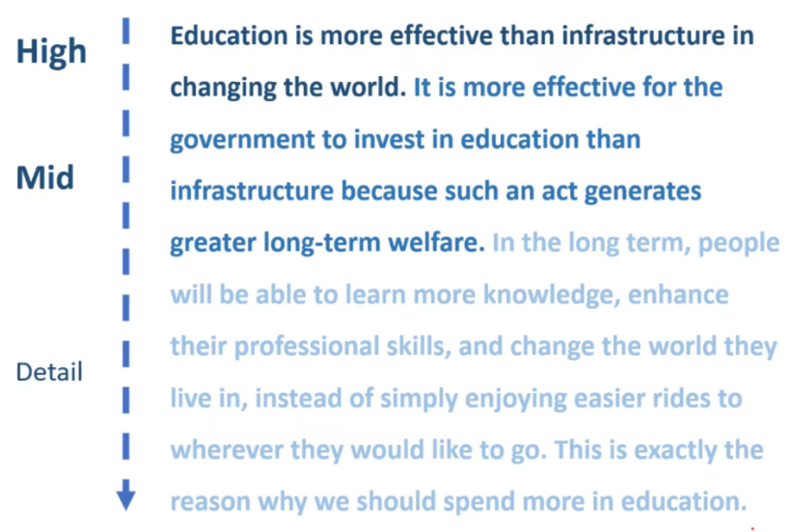
### Exemplification (generality, adequate, coherent):
Furthermore, the fact that (point2 mid level) indicates that (point 2 high level).
Take the case of (character), who/which (process). As a result, (result).
Had it not been for (process), (character) would never (result).

### Concession:
Nevertheless, a voice arises that ().
Ironically, ().
Therefore, (Point3).
Ending:
##In conclusion, I maintain that ().
Admittedly, as my favorite quote from () goes, (), and some people may oppose me
However, I believe they will compromise after being exposed to my article.
### Ending:
As was stated above, … is what I maintain
Give priority to instead of
Divert resources to
Place a heavy emphasis on

### Brainstorming:
#### Time:
occupy/eat into precious but limited time
#### Economy:
affordable/cost-effective
lay/impose a financial burden on
#### Health (mental and physical):
release pressure and alleviate fatigue
sth serves as an outlet for my negative emotions
sth calm my nerves and restore my soul
#### Relationship:
Make more contacts
Pick up with like-minded friends
broaden/enlarge/expand social networks/friend circle
fair-weather friends 酒肉朋友
#### Knowledge:
broaden knowledge base and enrich social experiences
#### Technology (Internet, transportation, health care):
unprecedented advancement of science and technology
scientific and technological breakthrough/ technology develops in leaps and bounds
#### Government:
make laws/ carry out policies/ enact regulations
government funding/grant/subsidy
#### Environment
severely contaminated environment
increasing pressure/ hectic schedule/ intense and demanding life pace/ overbooked schedule
be faced with/ be confronted with/ be overload with
#### Awareness:
raise awareness

# Speaking
## Task1

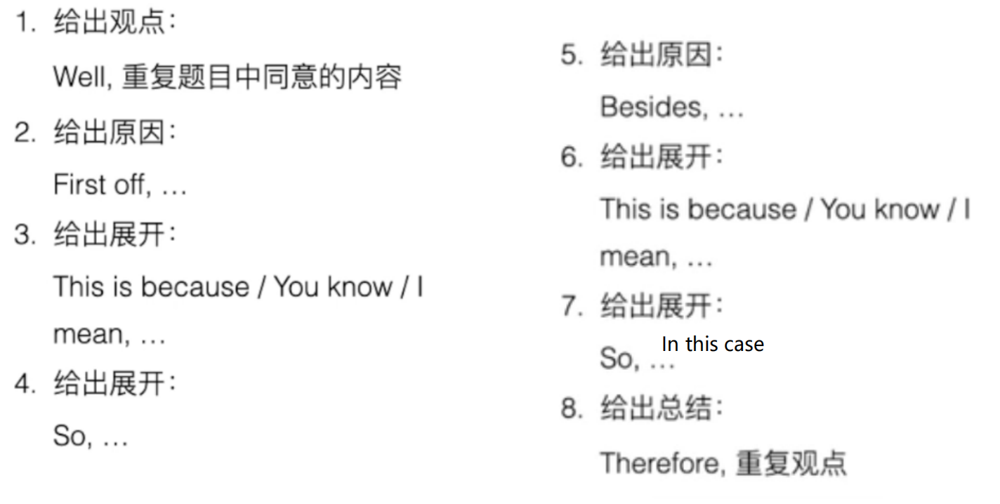

**万能理由：**

**1.金钱**

**2.时间**

**3.健康**

**4.方便**

**5.提升能力/学习**

**6.交朋友/社交**

**7.积极的感受（骄傲，放松，自信，动力,有趣）**

**8.效率**

**9.职业发展**

**Tips：**

1.常举例子，for example， such as……，on the contrary

2.没有思路的时候可以尝试mixed opinion: I kind of have a mixed opinion towards…… first off, I partly agree that……however, I am also worried that……

3.要是时间没说够，最后总结：because of the two reasons, I……

4.避免重复提及某个名词

具体：

### 1.金钱

Cause a heavy financial burden, tough on my budget

Achieve my financial goal to buy a car and a house

Alleviate a financial burden to live a more comfortable life

Pay my study loans and debts, insurance

A higher salary gives me the capacity to treat my parents better, vacation, medicine treatment

### 2.时间

Time-consuming

Over-occupied with so many works, laboratory assignment, academic tasks, cause heavy burden and pressure to them

### 3.健康

Help students to stay in shape, burning calories, stay healthy and gain a robust body, reduce the risks of some diseases like obesity and heart diseases

Increase the risks of getting hurt injured, bone fracturing

### 4.方便

Convenience

Cause a lot of trouble/troublesome

### 5.提升能力/学习

1.A precious chance for me to exercise to improve my skills/abilities to……

2.Enhance your academic capacity and make you more competitive in your future career

3.benificial for their holistic development/study

4.consolidate their understanding of their courses and get better grades

5.broaden your perspective, critical thinking, eye-opening, global perspective, respect different culture

### 6.交朋友/社交

1.improve your social abilities: read facial expression and tones to understand other people

2.reinforce the bones between each other, closer to each other, broaden your social circle and resources

3.exercise your ability to express yourself, voice out own opinion

4.take myself as an example, used to be an introverted person, but now

5.group discussion, examine a problem from others perspective and get a more comprehensive and overall understanding of……, a big picture towards……, broaden my perspective, make a brainstorming

### 7.积极的感受（骄傲，放松，自信，动力，有趣）

1.成就感： A sense of achievement, though more challenge, finish it successfully, be proud of myself

2.动力：stimulate them to have the passion to……, make them to have/lose the incentive to do

3.有趣：might be tedious, with so much repetition, kills all the fun of it

Interesting, have the passion to do

4.放松/压力：reduce your pressure and anxiety/fatigue, empty your mind, take a breath, refresh yourself， make you more active

Put to much pressure and stress on your shoulder

5.自信：build up their mindset, become more confident to express yourself

### 8.效率

Effective and efficient

Enhance the productivity and efficiency of my work

Without so many distractions, be more focus on your assignment

Spend limited time on something to be more efficient

Technology: information is accessible through your fingertips, type a few key words in the search engine

An instant feedback to help your problem\

### 9.职业发展

1.make you more competitive in your future career

2.prepare students better for their future career

3.acquire the necessary skills and competence in the job market,

4.get a well-paid job, higher income

5.liveup to your supervisors’ expectation, your bosses will trust you and in the long run, even give you a promotion

### 表达
Holistic development, a precious chance to prepare them to……
Enhance their capacity to
Obtain/consolidate their knowledge/ability/comprehension
Stimulate their interest/passion to……
Increase your competitive edges in future career/interview
Administrator/supervisor evaluate your performance based on……
Stimulate one’s passion to do ; incentive
Social/communicative skills: encounter numerous persons from different background and culture; through mutual communication; broad horizons; examine a problem from others’ perspective;
Concentration; focus on something; without distraction

## Task2/3/4

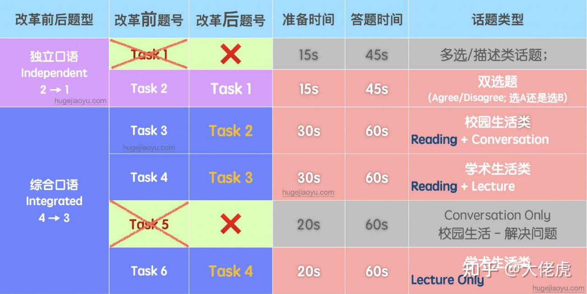

### Task1
As far as I am concerned …(paraphrase)
One major benefit doing …
Another reason that I think …
Common ways to expand arguments: Why? Details? If…so what?
### Vocabulary
Biology / business / psychology / sociology / art / history
Botany, zoology
Flora, fauna, vegetation, animals
Endotherms, ectotherms
Mammals
Reptiles
Amphibians
Insects
Predators / preys
Habitat, ecosystems
Carnivores / herbivores / omnivores
Omnipotent, omniscient

Head, scalp, skull, pupils, cornea, eyelashes, eyebrows
Cheek, nostrils, gum, throat, tongue, neck, temple
Shoulders, back, chest, breasts, breast-feeding, belly
Vital organs, rib cage
Heart, lungs, kidneys, spleen, liver, stomach, intestines, pancreas
Glands, legs, thighs, blood vessels, arteries, veins
Cells, tissues, organs
Elbows, wrist, knuckles, finger tips, finger prints, ankle, toes

Bundle up to face the cold
### Task2
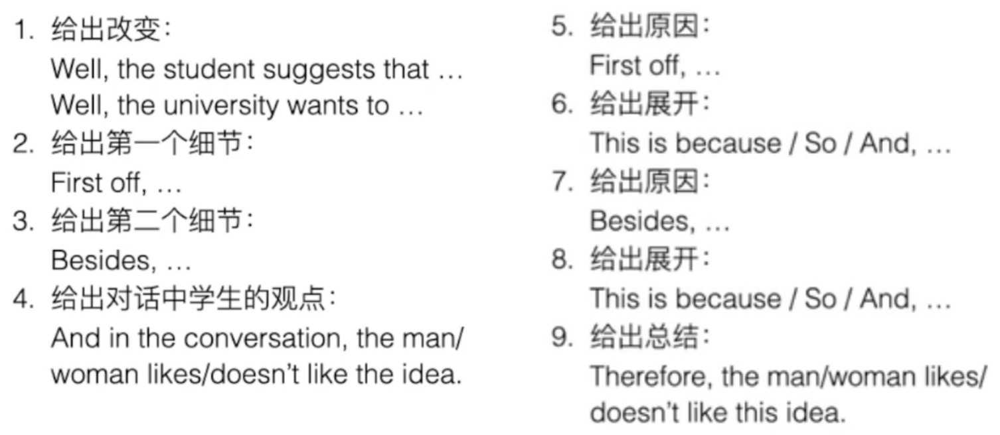

According to the announcement / proposal / letter
The student think this is a great idea for 2 reasons
### Task3
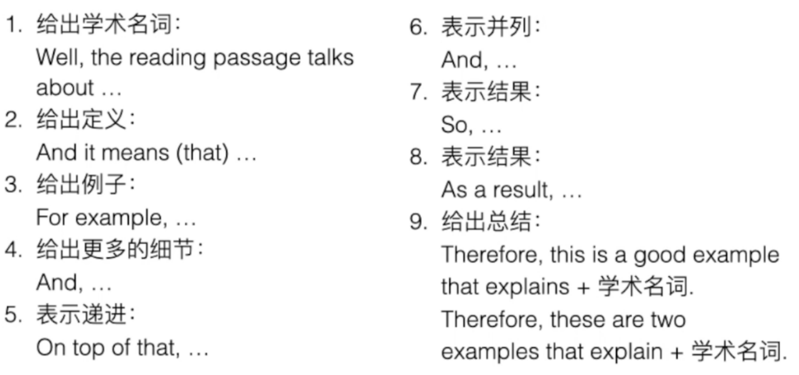

The concept “” basically means
In the lecture, the professor used … as an example to explain it.
### Task4
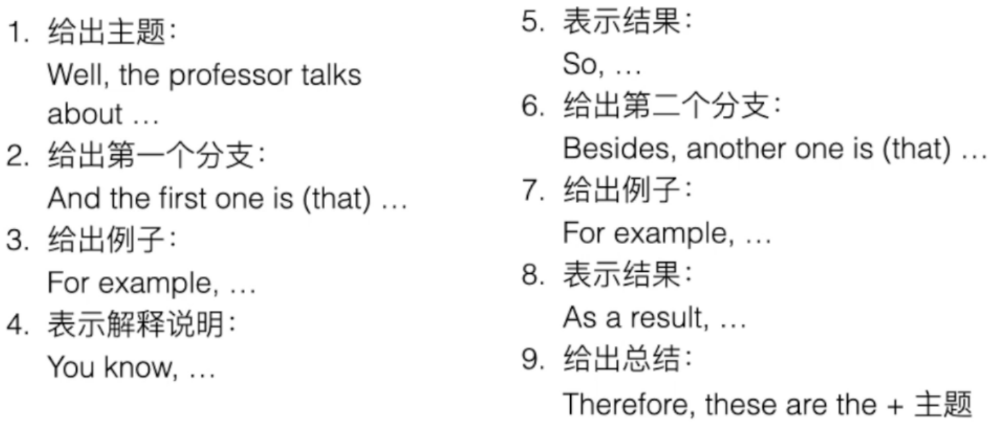
In the lecture, the professor talks about, from 2 aspects

These examples (this example) demonstrate

### 细节

#### 独立口语模板

1. Personally, I would like to say that my favorite is.../sth would be a better choice compared to... And there are a couple of reasons to name. The most important thing is that.../Above all... What’s more... So that’s why...
2. Well, in my view, I would definitely agree with the point that...The first reason I want to say is that... More importantly... So, that’s why I choose... for the two reasons listed above.
3. Personally speaking, I prefer... for several reasons/I think... ...for several reasons.Firstly,... Besides, in my experience......
    
    is more appropriate for
    
    Probably the most important reason for my preference is that
    
- 快速介绍主题，阐明自己的观点

1. Personally, I believe xx is better than xx for couple of reasons...

2. In my view, xx seems to be better than xx because...

3. To me, xx is a better option than...And I feel this way for two reasons...

- 解释选择该选项的第一个原因并用相关细节与例子来支撑观点
1. First off, ...for example...
2. For one...For instance...
3. One reason is that...What I mean by this is that...
- 解释选择该选项的第二个原因并用相关细节与例子来支撑观点
1. Secondly,...
2. My second reason is that...
3. Another reason is that...
4. More importantly...
- 简短的结束语来结束回答
1. This is why I believe/think that...
2. And this is why I prefer...
3. For the reasons above, I feel that xx is a better option than...

#### 综合口语模板
##### Task2：
1. In the lecture, the professor mainly talked aboutthe theory that... To reinforce the theory, the professor gave two reasons/examples in his speech.The first one is that... The second one is that...And that’s the two reasons/examples the speaker presented to explain his idea.

##### Task3：

- 解释校园情况，对文章内容和说话者所谈内容进行简短总结
1. According to the passage/announcement/flyer, the university plans to...
2. The school intends to...
3. The passage/announcement/flyerexplains that the university is considering...
- 表述为什么学生同意或不同意学校的提议或改变
1. The student agrees/disagrees with the school’s changes/decision/proposal for two/three reasons.
2. The student supports/opposesthese changes for...
3. However, the student doesn’t support this plan.
- 解释一下学生支持或反对这些变化的主要观点，详细说明这一点是什么以及为什么学生会有这种感觉，使用对话中的证据
1. First, the student believes/feels/thinks..
2. The first point the student makes is that..
3. One reason is that...
4. One reason he/she supports/opposes this proposal is that...
5. According to the student,...so...
- 解释学生提出的第二点，使用与第一点相似的结构，解释学生为什么会有这种感觉
1. Secondly, the student believes/feels/thinks that...
2. The second point the student makes is that...
3. A second reason is that...
4. The student also remarks/says that...
5. Additionally, the student believes/feels/thinks that...

##### Task4：

- 介绍文章和讲座的主题，以及要讨论的具体术语或概念
1. The passage discusses xx and how it...
2. The main focus of the passage is...
3. Both the passage and the lecture discuss...
4. According to the lecture, xx is...
5. The passage introduces the concept of...
- 用文章和/或讲座中的一点来描述这个概念的含义，尽量用课堂上的例子说明细节
1. In the lecture, the professor defines xx as...
2. The professor first mentions that...
3. First off, the professor talks about...
- 介绍教授或文章中关于这个概念的另一个观点，使用课堂上的具体例子
1. Next, the professor discusses...
2. The professor also explains that...
3. Additionally, the professor says that...
4. Another example the professor gives is that...
- 用简短的概述结束回答
1. This is what xx means.
2. And this is the meaning of...
3. So this is how the professor describes...

reach consensus on sth 在...上达成共识

...have long be a topic of great interest ...是人们一直感兴趣的话题

be conformable with... 与...相一致

make productive use of... 高效利用...

provided sb stay/动词 together in a tight bunch 只要...紧密团结在一起

# 语料库 (unorganized)

## 例题
### 1. adventurous/cautious

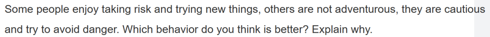

It’s undeniable that our daily life requires constant caution to keep us away from danger, it’s a beautiful quality of cherishing life. However, in the long term, I always believe that a high quality life requires lots courage to take risks and the curiosity to try new things. Life is limited but fun of the world is infinite. We may not necessarily have to attempt extreme sports like skydiving and rock climbing but there are something not to be missed(unmissable), such as an opportunity to express ourselves on the stage,or exploring an interesting field **from scratch**.We mortals only live once, so we need to ceaselessly try to break through ourselves, to experience things that we have never met before,good or bad, and finally make everything worth the ticket price of living.

### 2. 如何花钱

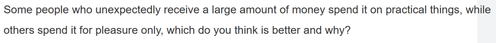
To my mind, using unexpected wealth for practical purposes would be a better choice. Although spending it for pleasure only would give us lots of instant gaiety, it wouldn’t be a long-term policy/it’s obviously not sustainable for long periods, as wealth will eventually be depleted one day. However, if I use it to enroll in tutoring class like dancing or programming, I will acquire some useful skills permanently. For example, learning programming makes me more competitive in the job market so I may be able to earn more money in the future. Or, I can simply use this money for financial investment, even if I didn’t be lucky enough to make more money,I have practiced how to manage my finances.

### 3. learn other culture
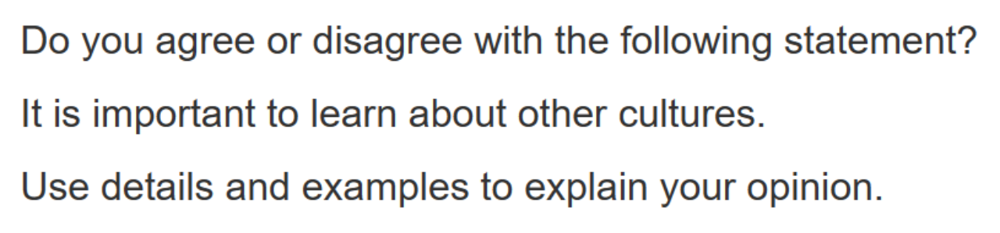
I really think learning about other cultures holds great significance for several reasons. First, comprehension of exotic culture expends our mental frontiers so it may equip us with a more open and inclusive attitude towards various things around the world, which benefits us a lot in the increasingly interconnected globalized world. Also, learning about foreign culture may provide us more opportunities to make acquaintance with people from all over the world, and we may find common topics with each other and finally becomes friends.It enlarges my social circle spontaneously.

### 4. online/offline
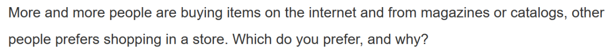
For me, I prefer shopping online for lots of reasons. First, online shopping is time-saving and flexible as I can buy what I want just by searching online and don’t need to waste hours waiting for transportation driving me to the store. What’s more, large shopping platform provides us with a wide range of selections so we are more likely to get what suits the most while it will take hours for us to find something ideal in traditional offline stores crowding with people. Also, because online retailers don’t need to pay for rental costs, the products may be cheaper with the same quality. That’s why I prefer online shopping.

### 5. alone/group
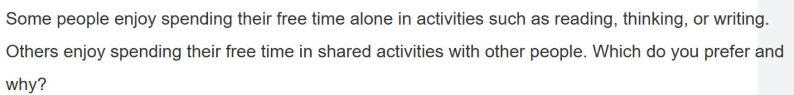
For me, spending free time in shared activities with other people seems to be a better option even if staying alone also offers something valuable. First, as a person with outgoing disposition, getting along with others makes me more energetic and refreshing after tiring daily routines. What’s more, in the process of shared activities, I can expend my mental frontiers by chatting with people from various background, and this may equip me with a more open and inclusive attitude towards various thing around the world, which helps me to be better accustomed to the increasingly interconnected world. At the same time, I can enlarge my social circle.

### 6. 省钱/花钱
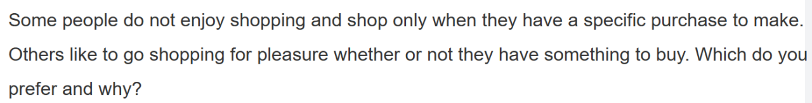
In my view, I consider shopping only when I have a specific purchase to make would be a better option for several reasons. First, it can reduce impulsive consumption and prevent me from buying something useless for instant gaiety, which will not only waste money for no reason but occupy more storage space. What’s more, staying away from casual consumption does helps with money management and financial investment, enables me to have a big purchase whenever I want and have enough money for future study or emergency.

### 7.

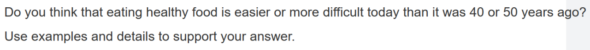

In my view, it’s much more easier for us to eating healthy food today than decades ago for several reasons. 

First, technology advances have helped to transform plants with larger seeds and fruits, faster germination and higher annual yield so crops with higher quality and healthy value are more accessible for us, which means people today have much more choices to maintain a healthy diet.

What’s more, the development of medicine has made us more aware of the dietary proportion and trace elements required by the human body, enabling us to better plan our diet.

### 8.

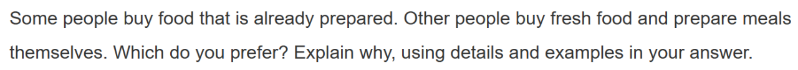

In my view, buying fresh food and prepare meals by my own would be a better choice for several reasons. For one thing, prepared food in restaurants is always much more expensive than raw food in grocery as the former’s price also includes store’ rental and labor costs, so self-catering habits can help us save lots of money for other use. Moreover, cooking our own food gives us more choices.We can make whatever we want to eat and make meals that are more suitable for our flavour, also, select materials with higher quality. Finally, there are many uncertainties in the hygiene of restaurants, on the contrary, our own meals are often healthy and hygienic.

### 9.
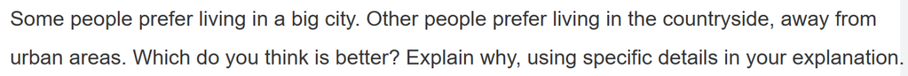

Personally, I prefer to live in a big city. First, it’s obvious that metropolis often have

### 10.

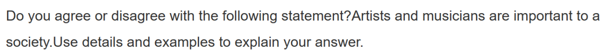

### 11.

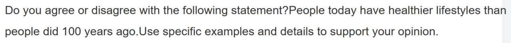

### 12.

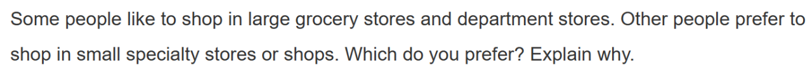

### 13.

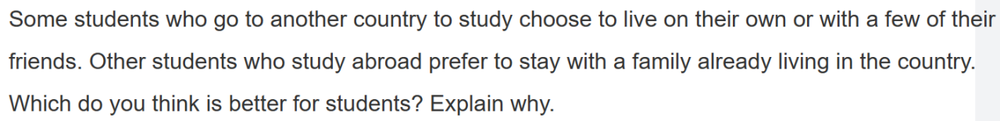

### 14.

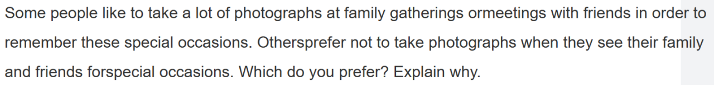

### 15.
- 电视对于现代社会会有正面作用还是负面作用？

In my view, television has more positive effects towards modern society than its negative sides. First, it offers us an efficient and convenient way to get the latest news around the world through vivid images, helping us open new avenues of thoughts. Moreover, television can lower unemployment rates and release our job seeking pressure to some extent by providing a job chance to people who are willing to be engaged in the related career. Last but not least, watching television with family members after a tiring day’s work do not only strengthens the emotional connections between loved ones, but provides us with a sense of refreshing.

万能模板：运动好处

1. 保持健康远离疾病：
2. 提高工作效率：more focused
3. 保持活力：
4. 维持良好的身材：

## 模版
### 万能模板：团队合作/独自学习

- ·团队合作
1. 与人相处使我活力倍增：As a person with outgoing disposition, getting along with others makes me more energetic and refreshing after tiring daily routines.
2. 提高团队合作能力：In the process of teamwork, my capabilities for practical cooperation have also improved, which is beneficial for further development.
3. 掌握与人相处的技巧：master skills to communicate and get along with others
4. 结合成员优势：
5. 掌握更多知识：
6. 培养更开放包容的心态：In the process of shared activities, I can expend my mental frontiers by chatting with people from various background, and this may equip me with a more open and inclusive attitude towards various thing around the world, which helps me to be better accustomed to the increasingly interconnected world.

拓宽交友圈：It provides us more opportunities to make acquaintance with people from different background, and we may find common topics with each other and finally becomes friends.It enlarges my social circle spontaneously.

- ·独自学习
1. 集中精力不被打扰：
2. 安排更灵活：
3. 团队合作可能会产生很多噪音打断工作：
4. 团队合作可能发生争执拖慢进度：
5. 团队合作可能有人摆烂/一些成员的付出未被认可：take a free ride

### 万能模板：开拓视野

1. 新的尝试与体验：Life is all about experiencing and we mortals only live once, so we need to ceaselessly try to break through ourselves, to experience/embrace things that we have never met before,good or bad, and finally make everything worth the price of living.
2. 提高生活质量：I always believe that a high quality life requires lots of courage to take risks and the curiosity to try new things. Life is limited but fun of the world is infinite. We may not necessarily have to attempt extreme sports like skydiving and rock climbing but there are something not to be missed(unmissable), such as an opportunity to express ourselves on the stage,or exploring an interesting field from scratch.
3. 增长知识：
4. 拥有更开放包容的心态：

### 万能模板：友情/亲情

1.调节情绪：xx with family members after a tiring day’s work do not only strengthens the emotional connections between loved ones, but provides us with a sense of refreshing.

- 万能模板：网络优势
1. 信息获取更便利：It offers us an efficient and convenient way to get the latest news around the world through vivid images, helping us open new avenues of thoughts.
2. 降低失业率：It can lower the unemployment rates and release our job seeking pressure to some extent by offering more job information and providing a job chance to people who are willing to be engaged in related career.
3. 节省时间：Online xx is time-saving and flexibleas I can xx what I want just by searching online and don’t need to waste hours waiting for transportation driving me to the xx...
4. 更多选择：Large shopping platform while it will take hours for us to find something ideal in traditional offline stores crowding with people.
    
    provides us with a wide range of selections so we are more likely to get what suits the most
    
5. 节约成本：Because online retailers don’t need to pay for rental costs, the products may be cheaper with the same quality.

### 万能模板：公共交通

1. 减少人均碳排放缓解温室效应：Public transport is a greener form of travel and the popularity of public transportation often means the carbon emissions per head are largely reduced, and this can protect our environment by reduce exhaust emission and release the green house effect.
2. 便宜：It’s economical because we don’t need to pay for patrol, parking, maintenance and cleaning costs which is inevitable driving our own car.
3. 交通网络完善且选择多样：Nowadays, the public transportation system is constantly improving with the economic development, and the rise of high-speed rail and subway has greatly facilitated people’s travel.
4. 方便且节约时间：It’s convenient and time-saving as the navigation is taken care of so we can use time to do plenty of other things like skimming through news or listening to music without concerns about traffic accidents.

### 万能模板：大城市/乡村

- ·城市
1. 交通便利：
2. 教学质量高：
3. 娱乐设施完备：
4. 更多就业机会：
5. 更多探索自我的机会：
- ·乡村
1. 生活压力小：
2. 交通通畅不堵车：
3. 生活成本低：
4. 环境好污染少：
5. 亲近自然：offer chances to commune with nature

### 万能模板：娱乐/学习

- ·学习
1. 更高竞争力：Develop good habits of learning and mastering more skills help us become more competitive in the job market as opportunities are always limited and only reserved for those who are prepared.
2. 合时宜-学习是学生的首要任务：Acquiring knowledge and skills is always the top priority of students at certain specific stages like high school, so we need to seize the best time and endeavour to better ourselves.
3. 掌握更多的知识技能-对生活有帮助：In addition to professional knowledge related to our major, learning also allows us acquire more skills that are helpful in daily life and helps us become a whole person.
- ·娱乐
1. 生活重在体验：Life is all about experiences and we mortals only live once, so we need to ceaselessly try to experience things that we have never met before, good or bad, and finally make everything worth the ticket price of living./There are so many things worth experiencing in this world except studying and working, also, becoming an ascetic monk isn’t the only way to achieve the true meaning of life.
2. 舒缓压力：Entertainment can relieve accumulated fatigue and stress, which may crush you in the near future and make the loss outweighs the gain.
3. 提高效率：Scientifically, appropriate entertainment can provide physical and mental pleasure, thereby improving study efficiency.
4. 娱乐是一种维系感情的方式：Human life is not single-threaded, even the most passionate workaholic still needs the bonds of family and friendship to varying degrees that are somehow derived from entertainment.
5. 娱乐并不会使自律的人分心：Entertainment won’t distract someone who is self-disciplined and likewise, undisciplined people will suffer a hard time focusing on their studies even without any amusement.

### 万能模板：省钱好处

1. 减少冲动消费：It can reduce impulsive consumption and prevent me from buying something useless for instant gaiety, which will not only waste money for no reason but occupy more storage space./Although spending it for pleasure only would give us lots of instant gaiety, it wouldn’t be a long-term policy/it’s obviously not sustainable for long periods, as wealth will eventually be depleted one day.
2. 理财投资：Staying away from casual consumption does helps with money management and financial investment/I can simply use this money for financial investment, even if I didn’t be lucky enough to make more money,I have practiced how to manage my finances.
3. 财富自由-更多选择：It enables me to have a big purchase whenever I want and have enough money for future study or emergency.
4. 花有意义的钱：If I use it to enroll in tutoring class like dancing or programming, I will acquire some useful skills permanently. For example, learning programming makes me more competitive in the job market so I may be able to earn more money in the future.

### 一、便宜

- Useful expressions：

便宜：cheap, inexpensive, reasonable price

昂贵：expensive, extortionate, cost a fortune

Squander v.挥霍

- Samples：

1、It's cheap and economical.

2、It can help me save a lot of money to buy books or to travel with my friends.

3、I hate squandering, so I think it is awesome.

### 二、省时省力

- Useful expressions：
- time-saving, energy-saving
- Handyadj.好用的，便利的
- Samples：

1、It is convenient and I would be able to save tons of time.

2、It’s time-saving and I can spare some time on my personal interests.

### 三、结交朋友

- Useful expressions：

1、bond n.情感纽带  v.建立关系

2、meet more people

3、socialize v.社交

4、expand one’s social circle/network

5、Build bridges

- Samples：

1、The experience created a very special bond between us.

2、A good option to expand your social circle and find people with the same interests as you is to join some clubs.

3、I can make more friends from different cities/countries/with the same interest.

4、And I can also learn some useful interpersonal skills or personality such as honesty and persistence

### 四、好环境

- Useful expressions：
- Stunning/picturesque/breathtakingview
- Refreshing/refreshmymind 让人神清气爽
- Samples：

1、The amazing part is its picturesque view and enjoyable surroundings.

2、Having a walk beside the lake and rockery, I can smell the fragrance of grass and the flowers and hear the cries of the birds and feel the bracing breeze on my face.

### 五、减压放松

- Useful expressions：

1、unwind

2、calm/ calm down

3、loosen up

4、chill/ chill out

5、release pressure/tension

- Samples：

1、I can totally relax in such a......environment.

2、I'm fascinated to the harmonious atmosphere which could make me refreshed and energetic.

3、I can release my emotion, pressure and uneasiness through it, and have a temporary escape from the academic workload such as assignment and examination.

4、I would like to join a hiking club since it offers me an opportunity to release pressure/ tension.

5、Music helps us calm down, especially for students who are stressed out when preparing exams or doing homework.

6、 Music helps me unwind after a busy day.

### 六、健康

- Useful expressions：
- fullofnutrients like protein and vitamins
- Preventionisbetter than cure 预防甚于治疗
- Samples：

1、It's good for my health.

2、I can improve my speed, strength and flexibility.

3、And I can also effectively lose weight and keep in good shape.

4、Before……I often got sick, depression and hot temper, but now, everything is getting much better.

## 独立口语泛用语料

### 开拓眼界

【适用话题特征：涉及两者以上】

- 泛用语料：... would broaden my horizons / expand my vision since it opens up access to diverse ideas, perspectives, and values. As a result, I would achieve a more comprehensive understanding of the subject matter and ultimately ...

例1：Do you prefer to study alone or study in a group?

I prefer to study in a group. The main reason is that discussing with other students would broaden my horizons since it opens up access to diverse ideas, perspectives, and values. As a result, I would achieve a more comprehensive understanding of the subject matter and ultimately come up with more effective solutions, which greatly boosts my learning efficiency.

例2：Some people prefer to make decisions based on their own experience while other people prefer to ask those around for help. Which do you prefer?

I prefer to ask those around for help. The main reason is that discussing with others would expand my vision since it opens up access to diverse ideas, perspectives, and values. As a result, I would achieve a more comprehensive understanding of the subject matter and ultimately make better decisions.

例3：If you have disagreements with one of your friends or family members over certain issues, do you prefer to persuade the other person into taking your side, or prefer to respect the differences?

I prefer to respect the differences. First of all, modesty is a virtue. I mean, listening to others patiently would expand my vision since it opens up access to diverse ideas, perspectives, and values. As a result, I would achieve a more comprehensive understanding of the subject matter and ultimately develop a mature/sophisticated worldview.

例4：Should students choose books from the school’s reading list, or should they choose books for themselves?

I prefer the former choice. First, having a uniform list means students could discuss with one another about the same books, which would broaden their horizons since it opens up access to diverse ideas, perspectives, and values. As a result, students would achieve a more comprehensive understanding of the subject matter and ultimately cultivate creative thinking.

### 感情&关系

【适用话题特征：涉及两者以上】

- 泛用语料：... would improve the relationship between me and X. You see, I’m usually quite occupied with schoolwork and therefore seldom see X, so I want to use every possible opportunity to catch up with X on what’s new in our lives and create some really nice memories. ... would be perfect for this.

例1：Do you prefer to go to the museum alone or with a friend?

I prefer to go to the museum with a friend. The main reason is that this would improve the relationship between me and my friend. You see, I’m usually quite occupied with schoolwork and therefore seldom see my old friends, so I want to use every possible opportunity to catch up with my friend on what’s new in our lives and create some really nice memories. A museum trip would be perfect for this.

例2：Is it better to watch entertaining films or serious films?

I think the former choice is better. First of all, watching entertaining films with a friend would improve our relationship. You see, I’m usually quite occupied with schoolwork and therefore seldom see my old friends, so I want to use every possible opportunity to catch up with my friend on what’s new in our lives and create some really nice memories. A fun movie would be perfect in this case as opposed to a serious one.

### 交友&人脉

【适用话题特征：涉及两者以上；课余活动】

- 泛用语料：... provides a great way to meet new people and make friends. Having more friends means not just an active social life, but more importantly, a comprehensive scope to see the world. For example, they could offer advice/input on all sorts of matters, like dealing with stress, improving grades, and planning for the future career.

例1：Do you agree that all students should join some kind of student organizations?

I agree with this statement. The most important reason is that joining student organizations provides a great way to meet new people and make friends. Having more friends means not just an active social life, but more importantly, a comprehensive scope to see the world. They could offer advice on all sorts of matters, like dealing with stress, improving grades, and planning for the future career.

例2：To celebrate your birthday, do you prefer to throw a big party or keep it simple and just invite a few people?

### 金钱

【适用话题特征：赚钱、省钱】

- 泛用语料：

个人：It makes more sense financially. Being a student with limited disposable income, I must adhere to a strict budget and ensure that every dollar is spent wisely.If I could earn some extra cash / save money by ..., I would be able to ameliorate my economic situation and have more to afford my meals, pay my rent/tuition, and take up extra courses.

学校：This allows the university to generate an extra source of revenue / cut expenditures and in turn invest more in other areas, like purchasing more books for the library, upgrading laboratory equipment, and renovating the dormitories. I’m sure such investments would benefit students ultimately and improve their overall campus experience.

例1：There are two apartments to choose from. One apartment is near the campus but slightly more expensive while the other is a little far from the campus but cheaper. Which one do you prefer and why?

Personally speaking, the cheaper apartment is better. First, it makes more sense financially. Being a student with limited disposable income, I must adhere to a strict budget and ensure that every dollar is spent wisely.If I could save money by renting a cheaper apartment, I would have more to afford my meals, pay my tuition, and take up extra courses.

例2：Imagine that you have received offers from two universities. One university is well-known for its excellent academic program, but the tuition is expensive. The other is less well-known but has offered you scholarships. Which university do you prefer?

Personnally speaking, I would choose a well-known but expensive university. First, with a higher tuition fee, the university should have a better teaching quality and more facilities. Second, a famous university can help me in the future job market, which may give me more reward.

例3：The university plans to charge the public a fee for accessing resources in the library. Do you think this is a good idea?

例4：The university is going to shut down the computer center since many students already own a laptop of their own. Do you support this idea?

### 借鉴反思

【适用话题特征：历史、名人、年龄差距、犯错】

- 泛用语料：... would help us to reflect on ... and figure out how to improve for the better. To be specific, we learn not to repeat the same mistakes and also draw valuable lessons from the positive examples.

例1：Do you agree that we should learn the history of our hometown?

I tend to agree with this statement. The main reason is that learning local history would help us to reflect on our ancestors’ stories and figure out how to improve for the better. Specifically, we would learn not to repeat the same mistakes and also draw valuable lessons from the positive examples.

例2：Do you prefer to attend a dinner party with your peers or with your parents?

I prefer a dinner party with my parents. First of all, listening to my parents’ stories would help me to reflect on their lives and figure out how to improve for the better. Specifically, I would learn not to repeat the same mistakes and also draw valuable lessons from the positive examples.

例3：Do you think it’s okay for ordinary people to discuss the private lives of celebrities?

例4：Should parents allow their children to make mistakes?

### 电子设备

【适用话题特征：题目有关电子设备或其功能】

- 泛用语料：

Health: Studies show that prolonged exposure to electronic devices would result in health problems such as deteriorating eyesight, insomnia, and shorter attention spans. On top of that, students/kids would spend too much time staying indoors and gradually lose interest in human contact, which is detrimental to cultivating social skills.

Distraction: Students/Kids might be tempted to use their cellphones to do things unrelated to the class, like checking messages, reading the news, or even playing video games. Obviously, having a phone around would seriously decrease their learning efficiency.

例1：Do you prefer to read paper books or e-books?

例2：Should children have access to electronic devices as early as possible?

例3：Do you think professors should allow students to record their lectures?

### 放松&减压

【适用话题特征：不限】

- 泛用语料：... offers a great way to relax and alleviate stress. Students not only deal with heavy schoolwork but also have to juggle various extra-curricula activities, so it’s especially necessary for them to take a break and blow off some steam. For example, ... (这里可以结合某项具体活动来解释它如何实现放松的目的)

例1：Do you agree that high school students should study art and music?

Listening to pop music/catchy tunes always puts me in a cheery mood so going back to study later feels less depressing.

Listening to rock music gets me super pumped so I’m able to get away from all those negative feelings.

While painting, students are immersed in their own imagination and temporarily escape from the usual tedious routine.

### 谈资

【适用话题特征：不限】

- 泛用语料：... would serve as great conversation materials since it’s a topic of interest among a lot of people. Basically, if I share this knowledge with those who are interested, we could have a much easier time chatting and potentially become friends as a result.

例1：Do you think it’s okay for ordinary people to discuss the private lives of celebrities?

I agree with this statement. The first reason is that stories about celebrities would serve as great conversation materials since they are a topic of interest among a lot of people. Basically, if I share this with those who are interested, we could have a much easier time chatting and potentially become friends as a result.

例2：Do you agree that we should learn the history of other countries as well as of our mother country?

例3：Do you agree that one should learn the culture of a country before going there?

例4：Do you agree that video games are completely worthless for children?

### 培养能力品质

【适用话题特征：不限】

- 泛用语料：XX(activity) provides the perfect opportunity to help people cultivate Y(quality), which would . For example, ... (这里需要举例，简短地说明这个能力/品质在什么情况能发挥什么作用)
    
    play an important part in their future
    

例1：If a kid is unwilling to learn to play a musical instrument because it takes a lot of practice, should the parents force the kid to continue learning, or let the kid decide whether to continue or not?

例2：Do you prefer to work in a company that allows employees to solve problems with their own plans, or work in a company that requires employees to solve problems under specific guidelines?

例3：Do you agree that male and female university students should live in separate resident halls?

例4：Do you agree that good teachers should admit making mistakes or knowing little about something?

例5：Do you agree that children can have a pet?

# Refrence：
[新托福114分备考经验心得贴（个人向？（雾 - 知乎](https://zhuanlan.zhihu.com/p/659335828?utm_psn=1749402305353752576)

[Home Page](https://v2.ereg.ets.org/ereg/public/jump?_p=TEL)

[首页 - 教育部教育考试院托福网上报名](https://toefl.neea.cn/)

[【托福考满分官网】TOEFL课程_托福考试_托福真题_新托福模考_托福学习备考-托福考满分](https://toefl.kmf.com/home)

[TOEFL Resources | Test Resources](https://www.toeflresources.com/)

[HUGE®托福 – 做国内最专业的托福备考平台](https://www.hugejiaoyu.com/) -->
