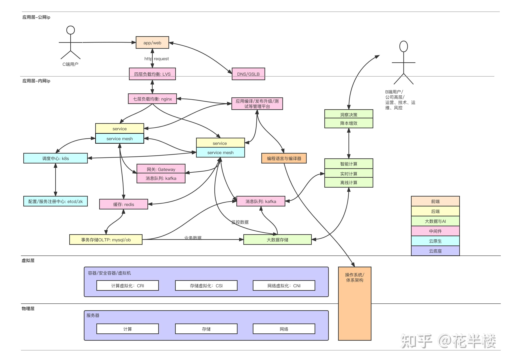

<!--
# 项目

## [gin-vue-blog](https://github.com/szluyu99/gin-vue-blog)
>Golang 全栈博客，支持 Docker Compose 一键部署。基于最新前后端技术栈 Vue3、TS、Unocs 、Redis 等。前端包含博文展示前台、博客后台管理系统。后端包含 JWT 鉴权、RBAC 权限控制等。代码质量高注释全接口文档完善，适合前后端开发者学习。
## [tiny-gpu](https://github.com/adam-maj/tiny-gpu)
> A minimal GPU design in Verilog to learn how GPUs work from the ground up
>[tiny-gpu – GPU入门教程](https://www.zhihu.com/pin/1766984245606744065?native=1&scene=share&utm_psn=1774264319405879296) | tiny-gpu 开源项目，对图形处理单元（GPU）的工作原理感兴趣的人提供学习机会，使用Verilog 硬件描述语言，tiny-gpu 项目创建功能最基础的 GPU 设计，允许用户深入到 GPU 的内部工作机制中去。
Verilog 作为一种在电子设计自动化（EDA）领域广泛使用的硬件描述语言，使得开发者能够描述电子系统的硬件结构与行为。通过编写 Verilog 代码，工程师们可以设计复杂的电子系统，比如 CPU、GPU 和其他专用集成电路（ASIC）。
tiny-gpu 项目的核心目标是提供一个教育工具，以帮助学生、爱好者甚至是专业人士去理解 GPU 的基本组成部分以及它们是如何协同工作的。这个设计可能包含如下几个关键部分：
>1. 流水线设计：一个简化的流水线结构，展示数据是如何在 GPU 内部流动和处理的。
>2. 渲染引擎：最基本的渲染引擎，可能支持简单的顶点和像素着色器功能，以便进行图形绘制。
>3. 内存管理：GPU 的内存访问模式，包括纹理内存和帧缓冲区的管理。
>4. 并行处理单元：模拟 GPU 的多个处理核心，用于执行并行操作，这是现代 GPU 强大计算能力的关键所在。
>5. 控制逻辑：处理指令流和调度任务的逻辑，确保不同部分的 GPU 可以协调工作。
>6. 接口：实现与外部世界连接的接口，如 PCI Express 或其他通信协议。
>
>通过这些模块tiny-gpu能够帮助用户了解 GPU 的基础概念，还能实际体验设计和验证过程，可以自行修改和扩展设计，实验不同的架构选择，仿真或实际芯片制造来测试他们的设计。
>这个项目还提供了丰富的文档和教程，指导用户如何从零开始构建自己的 GPU，如何用 Verilog 编写代码，如何利用仿真软件测试设计，以及如何在必要时将设计适配到 FPGA（现场可编程门阵列）上进行实验。tiny-gpu 项目是教育和实践相结合的完美示例，促进了硬件设计知识的普及，对计算机图形学和并行计算深层次探索的热情。
## Brainstorm
1. 手写mini vue ,mini react ，掌握源码原理 
2. 做开源组件库项目 
3. 低代码拖拉拽项目 
4. 拖拉拽生成流程图，思维导图

# 技术栈

## Frontend  
- HTML  
HyperText Markup Language
    
- CSS  
Cascading Style Sheets
    - preprocessor: bundler + tranpiler
        - SASS       
    - CSS Framework  
        - Bootstrap  
                
- JavaScript  
make webpage interactive
    - DOM: Document Object Model  
change the webpage
        - repetitive        
        - hard to manage  
                
        https://github.com/szluyu99/gin-vue-blog.git
    - JavaScript Framework  
    never use dom directly
        - ReactJS        
        - Angular    
        - VueJS  

    - JS miss features  that split code into different files and organize         
        - Bundler: let us to split, then combine all
            - Webpack  
                        
        - Transpiler: add extra features
            - TypeScript  
 
    - XMLHttpRequest  
    send a message to a url (backend)
        - axios-http  
        - fetch API  
                
      
        
## Backend  
- Backend Programming Language:  
        
    - JavaScript (NodeJS)      
    - Python        
    - Rudy  
    - Java  

- Backend Framework: 
Create a server much easier and with less code 
    - ExpressJS 
    - Python Django  
    - Rudy on Rails       
    - Java Spring  

- Package Manager: 
Packages: do calculation, talk to a database, and set up user login and authentication    
    - npm   
    - pip  
    - bundler     
    - maven  
            
## Database  
- Primary Databases:  
not good for storing images or text search
        
    - MySQL  
                  
    - PostgreSQL  
                   
    - MongoDB  
            
- Others: 
        
    - Redis  
    cache to take some stress off
            
    - Store Images  
                
        - Blob Storage (AWS S3)  
                     
        - CDN (AWS Cloudfront)  
                    
    - Search Database  
        text search
        - Elastic Search  
                     
    - Analytical Database  
        data science
        - Snowflake  
                     
    - Scheduled Tasks  
        - RabbitMQ  
        job queue to schedule tasks in the future

- API: Application Programming interface  
        
    - Rest: Representational State Transfer  
            
        - Type + Domain name + URL path  
        Post [https://amazon.com/orders](https://amazon.com/orders)  
        Uniform Resource Locator  
                  
        - POST: create  
                
        - GET  
                   
        - DELETE  

    - GraphQL  
        POST /graphql
        
    - RPC: remote procedure call  
        POST /createOrder, POST /getOrderHistory

## Infrastructure  
- Cloud Computing  
        
    - AWS: Amazon Web Services  
             
    - GCP: Google Cloud Platform  
            
    - Microsoft Azure  
            
- IaaS: Infrastructure as a service  
    rent Vitrual Machine
    - LB: Load Balancer  
    distribute requests evenly across VMs
- PaaS: Platform as a service  
    set up all VMs including LB, integrate everything
        
    - AWS Elastic Beanstalk  
            
    - App Engine for GCP  
            
    - App Service for Microsoft Azure  
            
- SaaS: Software as a service  
    provide a backend and an API
    - Twilio: Email Service Company  
            
- Microservices 微服务  
    split backend into separate ones, smaller and more focus

>**后端的技术主要是：**
>1. 应用业务逻辑开发
>2. rpc/REST
>3. 缓存，如redis
>4. 网关
>5. 消息中间件
>6. 事务存储，如mysql

>**infra开发包括五大类：云计算，云原生包括容器、调度等，中间件，大数据与AI以及系统软件。**
>- **云计算：**
    1. 计算虚拟化，如kvm
    2. 存储虚拟化，如容器的csi
    3. 网络虚拟化，如ipvlan和vxlan等
>- **云原生：**
    1. 容器，如docker
    2. 调度中心，如k8s
    3. 服务网格，如istio
>- **中间件：**
    1. DNS，如GSLB
    2. 网关，如api gateway
    3. 负载均衡，如LVS和ngnix
    4. 消息队列，如kafka
    5. 缓存，如redis
    6. 配置、服务注册中心，如ectc、zk
    7. 应用编译、发布、测试平台等
>- **大数据平台与AI：**
    1. 数据采集，主要包括元数据、业务数据和监控数据
    2. 大数据存储，如hdfs和elasticsearch等
    3. 离线计算，如spark
    4. 实时计算，如flink、spark streaming
    5. 全文检索，如elasticsearch
    6. 智能计算，如pytorch和params server等
    7. 可视化，如商业报表工具
>- **系统软件：**
    1. 操作系统
    2. 编程语言与编译器 --> 
