<!-- 
# Animation

## Geometric Transformations

The geometry of a mesh is defined by the vertex set
Applying a transformation to a mesh means transforming each vertex location
Simple transformations can be accomplished by multiplying a matrix times the vertex location
- Rotation
- Scale
- Translation
$$
\begin{bmatrix}
d & e & f & a \\
g & h & i & b \\
j & k & l & c \\
0 & 0 & 0 & 1
\end{bmatrix}
\begin{bmatrix}
x \\
y \\
z \\
1
\end{bmatrix}
$$

3 dimensional transformations are implemented as a 4x4 matrix
- We express the 3D position of a point using homogeneous coordinates…add a fourth w coordinate
- Each 3D position (x,y,z) corresponds to a homogeneous point (x,y,z,1)

### 3-D Affine Transformations
General Form (with homogeneous coordinates)
$$
\begin{bmatrix}
d & e & f & a \\
g & h & i & b \\
j & k & l & c \\
0 & 0 & 0 & 1
\end{bmatrix}
\begin{bmatrix}
x \\
y \\
z \\
1
\end{bmatrix}
=
\begin{bmatrix}
dx + ey + fz + a \\
gx + hy + iz + b \\
jx + ky + lz + c \\
1
\end{bmatrix}
$$

### Translation
$$
\mathbf{T}(\mathbf{t}) = \mathbf{T}(t_x, t_y, t_z) =
\begin{bmatrix}
1 & 0 & 0 & t_x \\
0 & 1 & 0 & t_y \\
0 & 0 & 1 & t_z \\
0 & 0 & 0 & 1
\end{bmatrix}
$$

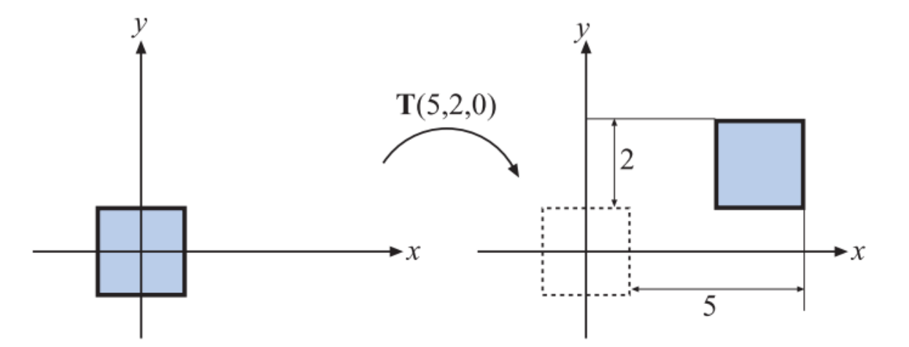
The inverse of a translation matrix is $T^{−1}(t) = T(−t)$, that is, the vector t is negated.

### Scale
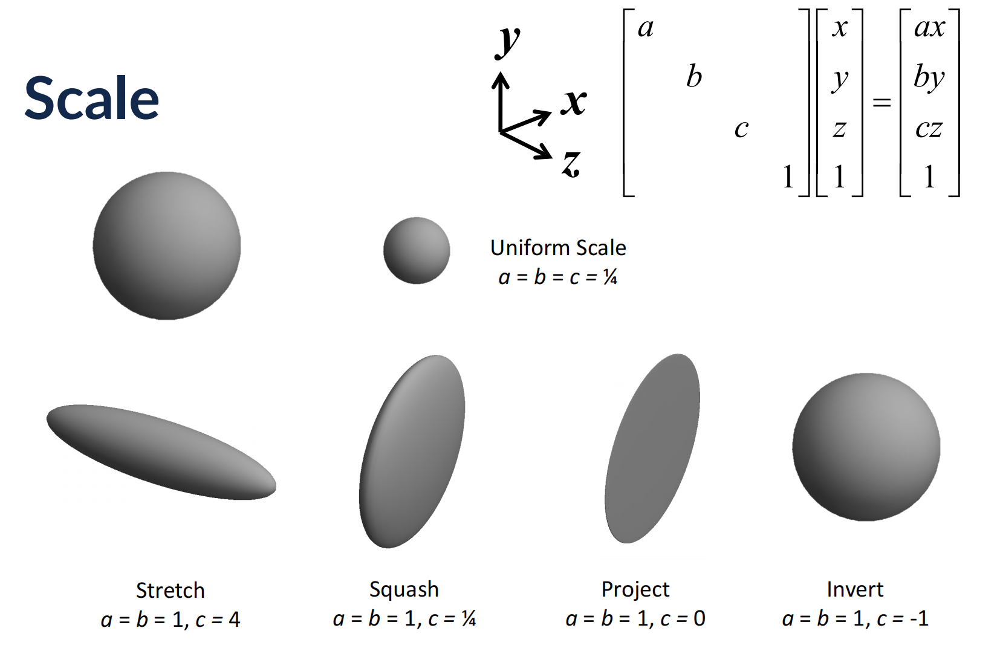

### 2-D Rotations: It’s Not Magic
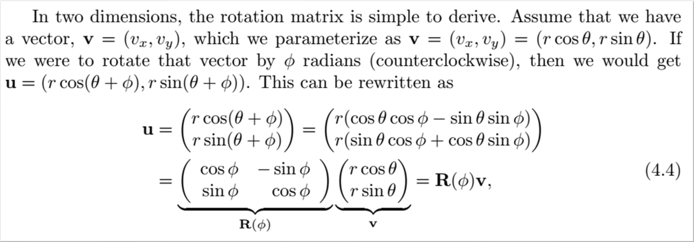Real-Time Rendering, Fourth Edition (Page 60).

### 3-D Rotations
About x-axis
- rotates y to z

$$
\mathbf{R}_x(\phi) = 
\begin{bmatrix}
1 & 0 & 0 & 0 \\
0 & \cos \phi & -\sin \phi & 0 \\
0 & \sin \phi & \cos \phi & 0 \\
0 & 0 & 0 & 1
\end{bmatrix}
$$

About y-axis
- rotates z to x

$$
\mathbf{R}_y(\phi) = 
\begin{bmatrix}
\cos \phi & 0 & \sin \phi & 0 \\
0 & 1 & 0 & 0 \\
-\sin \phi & 0 & \cos \phi & 0 \\
0 & 0 & 0 & 1
\end{bmatrix}
$$

About z-axis
- rotates x to y

$$
\mathbf{R}_z(\phi) = 
\begin{bmatrix}
\cos \phi & -\sin \phi & 0 & 0 \\
\sin \phi & \cos \phi & 0 & 0 \\
0 & 0 & 1 & 0 \\
0 & 0 & 0 & 1
\end{bmatrix}
$$

Rotations do not commute!
- Rotation is around the origin
- To rotate around a point p we have to: translate p to origin, rotate, translate back to p
- Example: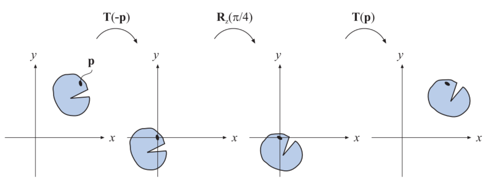

### Concatenating Transformations
You can execute a sequence of transformations using a single matrix 
$$M_{n} M_{n-1} ... M_2 M_1 p = Mp$$

Just compute the product of the transformation matrices
Important $M_1$ is applied first then $M_2$ and so on
- **Modeling transformation**: model is sized, placed and oriented in the virtual world 
$$ C = TRS $$ 
$$ TRSp = T(R(Sp)) $$

### Non-Commutativity Example
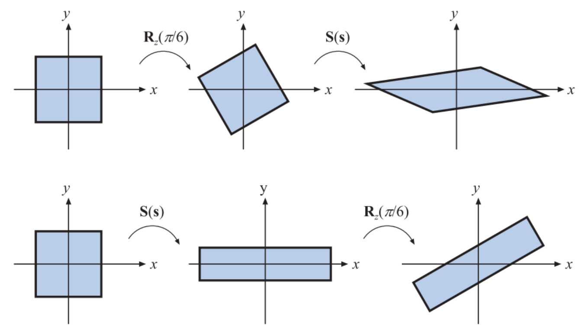
It generally holds that $MN != NM$, for arbitrary matrices $M$ and $N$.

### Use in Rigging
>3D rigging is the process of creating a skeleton for a 3D model so it can move. Most commonly, characters are rigged before they are animated because if a character model doesn't have a rig, they can't be deformed and moved around.

Each joint has a transformation associated with it
The rigging skeleton generates a tree of transformations
So, fingers are transformed a concatenated transform
Product of matrices from the chest to shoulder to elbow to wrist, etc.

## Orientation: Euler Angles
### Instancing
Vegetation instancing. 
All objects the same color in the lower image are rendered in a single draw call.
You render the same number of triangles as non-instancing…
So why is instancing more performant than using more meshes?

### Animation and Orientation
Interpolation is used to generate in-between frames from keyframes
At a minimum this means interpolating position and orientation of a model 
So…how can we represent orientation?

### Orientation
A model has an initial geometry (from the artist)
Changing that orientation requires rotation
How about just using a single rotation matrix?

Consider a 2D example
- Starting rotation is 90 degree clockwise
- Ending rotation is 90 degree counter-clockwise
- Doing element-by-element linear interpolation to get intermediate rotation
$$
\frac{1}{2}
\begin{bmatrix}
0 & 1 \\
-1 & 0
\end{bmatrix}
+
\frac{1}{2}
\begin{bmatrix}
0 & -1 \\
1 & 0
\end{bmatrix}
=
\begin{bmatrix}
0 & 0 \\
0 & 0
\end{bmatrix}
$$

- Does this make sense? Should we have expected something different?

#### Euler Angles
We can record an orientation as
- Three rotations
- Each rotation is around a principal axis
- Example: $$
\mathbf{E}(h, p, r) = \mathbf{R}_z(r) \mathbf{R}_x(p) \mathbf{R}_y(h)
$$

- This not only option
    - 24 different possible orders one could use
- Also, people use different terminology
    - e.g. “yaw” instead of “head”
    - Also which axis corresponds to a name is not standardized

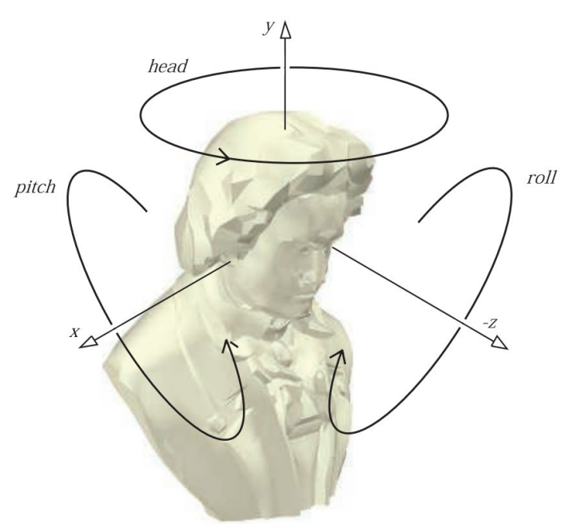

**The Good Part:**
- Three Euler angles can be used to specify arbitrary object orientation
    - i.e. any orientation we want can be achieved with these 3 rotations
- Euler angles are used in a lot of applications…they are believed to be intuitive
- They are compact…requiring only 3 numbers 
- Easily converted into a single rotation matrix

**The Problematic Parts:**
Are they really intuitive?
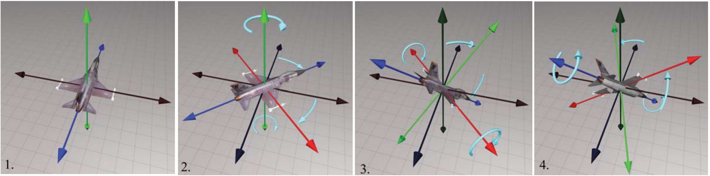
Each rotation is given in a new coordinate system
Plus, different triples can be used to generate the same orientation

#### Gimbal Lock
环架锁定（Gimbal lock），也称为万向锁，是使用动态欧拉角表示三维物体的旋转时会出现的问题。
Airplane orientation
- $$R_z(roll) R_x(pitch) R_y(yaw)$$
- Two axes have collapsed onto each other
- Think about this from a user-interface perspective

Imagine you have 3 dials…one for each angle
What action caused the orientation you see?
What happens when z dial is moved now?
What problem could this cause for someone playing a game with this interface? 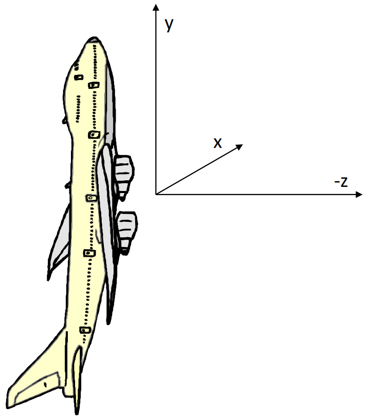

When the `middle` rotation is a 90 or -90 rotation, we generate gimbal lock
In this example, gimbal lock occurs when a 90 degree turn around axis Z is made
Both X and Y rotations are now performed around the same axis
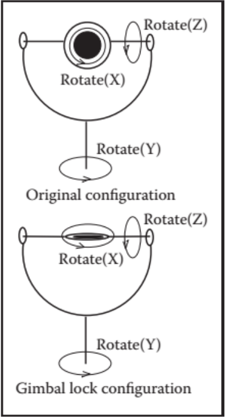

Is Gimbal Lock that Important?
>“In the video game industry there has been some back-and-forth battles about whether this problem is crucial. In an FPS game, the avatar is usually not allowed to pitch his head all the way to ±π/2, thereby avoiding this problem. In VR, it happens all the time that a user could pitch her head straight up or down. The kinematic singularity often causes the viewpoint to spin uncontrollably…”
-- Virtual Reality by Lavalle Section 3.3

#### Interpolation
Could linearly interpolate between each angle in a start pose and end pose to generate intermediate poses
- This doesn’t work well

It treats rotations as if they were independent of each other and completely ignores the effect they have on each other
- Can result in jerky, unnatural movement

## Orientation: Quaternions 四元数
- Alternative way of encoding orientation
- Game industry standard
- Both Unity and Unreal use them
- User interface may still use Euler Angles
    - Converted to quaternions under the hood

- Developed by Sir William Rowan Hamilton [1843]
- Quaternions are 4-D complex numbers with one real axis and three imaginary axes: $i,j,k$
$$q = q_0 + iq_1 + jq_2 + kq_3$$

- Introduced to Computer Graphics by Shoemake [1985]
- Given an angle and axis, easy to convert to and from quaternion
    - Euler angle conversion to and from arbitrary axis and angle difficult
- Quaternions allow stable and constant interpolation of orientations
    - Cannot be done easily with Euler angles

### Unit Quaternions
For convenience, we will use only unit length quaternions
$$|q| = \sqrt{q_0^2 + q_1^2 + q_2^2 + q_3^2} = 1$$
- These correspond to the set of 4D vectors 
- They form the ‘surface’ of a 4D hypersphere of radius 1

### Quaternions as Rotations
A quaternion can represent a rotation by angle θ around a unit vector a:
$$\pmb{q} = [ cos \frac{\theta}{2} \quad  a_x sin \frac{\theta}{2} \quad  a_y sin \frac{\theta}{2} \quad a_z sin \frac{\theta}{2} ]$$
or
$$\pmb{q} = \langle  cos \frac{\theta}{2} \quad \pmb{a} sin \frac{\theta}{2} \rangle $$
If $\pmb{a}$ is unit length, then $\pmb{q}$ will be also

### Rotation using Quaternions

- Let $q = \cos\left(\frac{\theta}{2}\right) + \sin\left(\frac{\theta}{2}\right) \mathbf{u}$ be a unit quaternion: $|q| = |\mathbf{u}| = 1$
- Let point $\mathbf{p} = (x,y,z) = xi + yj + zk$
- Then the product $q \mathbf{p} q^{-1}$ rotates the point $\mathbf{p}$ about axis $\mathbf{u}$ by angle $\theta$
- Inverse of a unit quaternion is its *conjugate*
  - ...just negate the imaginary part
- $q^{-1} = \left(\cos\left(\frac{\theta}{2}\right) + \sin\left(\frac{\theta}{2}\right) \mathbf{u}\right)^{-1} = \cos\left(-\frac{\theta}{2}\right) + \sin\left(-\frac{\theta}{2}\right) \mathbf{u} = \cos\left(\frac{\theta}{2}\right) - \sin\left(\frac{\theta}{2}\right) \mathbf{u}$
- Composition of rotations $q_{12} = q_1 q_2 \neq q_2 q_1$

### Quaternion to Matrix
To convert a quaternion to a rotation matrix:
$$
\begin{bmatrix}
1 - 2q_2^2 - 2q_3^2 & 2q_1q_2 + 2q_0q_3 & 2q_1q_3 - 2q_0q_2 \\
2q_1q_2 - 2q_0q_3 & 1 - 2q_1^2 - 2q_3^2 & 2q_2q_3 + 2q_0q_1 \\
2q_1q_3 + 2q_0q_2 & 2q_2q_3 - 2q_0q_1 & 1 - 2q_1^2 - 2q_2^2
\end{bmatrix}
$$

### Matrix to Quaternion

Matrix to quaternion is not hard
- it involves a few 'if' statements,
- a square root,
- three divisions,
- and some other stuff

`tr(M)` is the trace
- sum of the diagonal elements

\[
q_0 = \frac{1}{2} \sqrt{tr(M)}
\]

\[
q_1 = \frac{m_{21} - m_{12}}{4q_0}
\]

\[
q_2 = \frac{m_{02} - m_{20}}{4q_0}
\]

\[
q_3 = \frac{m_{10} - m_{01}}{4q_0}
\]

> This assumes $ M $ is a 4x4 homogeneous rotation matrix...so the diagonal ends with a 1

### Quaternion Dot Products
The dot product of two quaternions:

$$
\mathbf{p} \cdot \mathbf{q} = p_0q_0 + p_1q_1 + p_2q_2 + p_3q_3 = |\mathbf{p}||\mathbf{q}|\cos\phi
$$

The angle between two quaternions in 4D space is `half` the angle one would need to rotate from one orientation to the other in 3D space.

### Quaternion Multiplication

We can perform multiplication on quaternions
- we expand them into their complex number form

$$
\mathbf{q} = q_0 + iq_1 + jq_2 + kq_3
$$

If $ \mathbf{q}=(s,\mathbf{v}) $ represents a rotation and $\mathbf{q'=}(s',\mathbf{v}') $represents a rotation,
$\mathbf{qq'}$ represents $\mathbf{q}$ rotated by $\mathbf{q'}$

This follows very similar rules as matrix multiplication (i.e., non-commutative)

$$
\mathbf{qq'} = (q_0 + iq_1 + jq_2 + kq_3)(q_0' + iq_1' + jq_2' + kq_3') 
$$
$$
= \langle ss' - \mathbf{v} \times \mathbf{v}', s\mathbf{v}' + s'\mathbf{v} + \mathbf{v} \times \mathbf{v}' \rangle
$$

> It's just like multiplying 2 rotation matrices together...

Two unit quaternions multiplied together results in another unit quaternion
This corresponds to the same property of complex numbers
Remember(?) multiplication by complex numbers is like a rotation in the complex plane
Quaternions extend the planar rotations of complex numbers to 3D rotations in space

### Linear Interpolation

- If we want to do a linear interpolation between two points **a** and **b** in normal space:

$$
\text{Lerp}(t, \mathbf{a}, \mathbf{b}) = (1-t)\mathbf{a} + t\mathbf{b}
$$

where $t$ ranges from 0 to 1.

- Note that the Lerp operation can be thought of as a weighted average (convex).

- We could also write it in its additive blend form:

$$
\text{Lerp}(t, \mathbf{a}, \mathbf{b}) = \mathbf{a} + t(\mathbf{b}-\mathbf{a})
$$

### Spherical Linear Interpolation
- If we want to interpolate between two points on a sphere (or hypersphere), we do not just want to Lerp between them
- Instead, we will travel across the surface of the sphere by following a ‘great arc’
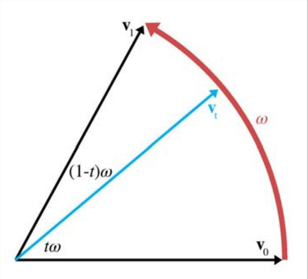

- The spherical linear interpolation of two unit quaternions **a** and **b** is:

$$
\text{Slerp}(t, \mathbf{a}, \mathbf{b}) = \frac{\sin((1-t)\theta)}{\sin \theta}\mathbf{a} + \frac{\sin(t\theta)}{\sin \theta}\mathbf{b}
$$

where:
- $\theta = \cos^{-1}(\mathbf{a} \cdot \mathbf{b})$

### Quaternion Interpolation
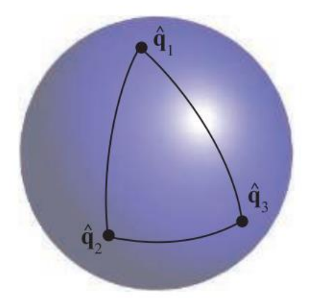
- Useful for animating objects between two poses
- Not useful for all camera orientations
  - up vector can become tilted and annoy viewers
  - depends on application
- Interpolated path through SLERP rotates
  - around a fixed axis
  - at a constant speed
  - so, no acceleration

If we want to interpolate through a series of orientations $\mathbf{q_1}, \mathbf{q_2}, \ldots, \mathbf{q_n}$, is SLERP a good choice?

### Chained Quaternion Interpolation

>When more than two orientations, say $$ q_0, q_1, ..., q_{n-1}$$, are available, and we want to interpolate from $$ q_0 $$ to $$ q_1 $$ to $$ q_2 $$, and so on until $$ q_{n-1} $$, SLERP can be used in a straightforward fashion. However, using $$ q_{i-1} $$ and $$ q_i $$ as arguments to SLERP, and then $$ q_i $$ and $$ q_{i+1} $$ as subsequent arguments, can cause sudden jerks to appear in the orientation.

- **Can smooth the path by using a spherical curve instead of a straight line**

>A better way to interpolate is to use some sort of spline. We introduce quaternions $$ \hat{a}_i $$ and $$ \hat{a}_{i+1} $$ between $$ q_i $$ and $$ q_{i+1} $$. Spherical cubic interpolation can be defined within the set of quaternions $$ q_i, \hat{a}_i, \hat{a}_{i+1}, $$ and $$ q_{i+1} $$. Surprisingly, these extra quaternions are computed as shown below:

$$
\hat{a}_i = q_i \exp\left(\frac{\log(q_{i-1}^{-1} q_i) + \log(q_i^{-1} q_{i+1})}{4}\right)
$$

The interpolation function, **SQUAD** (Spherical Quadrangle Interpolation), is defined as:

$$
\text{squad}(q_i, q_{i+1}, \hat{a}_i, \hat{a}_{i+1}, t) = \text{slerp}(\text{slerp}(q_i, q_{i+1}, t), \text{slerp}(\hat{a}_i, \hat{a}_{i+1}, t), 2t(1 - t))
$$

This approach allows for a smooth transition between quaternions, minimizing abrupt changes in orientation.

### Interpolating Quaternions: The Hack
Interpolating quaternions should be done on the surface of a 3D unit sphere embedded in 4D space. 
However, much simpler interpolation along a 4D straight line (open circles) followed by reprojection of the results onto the sphere (black circles) is often sufficient.
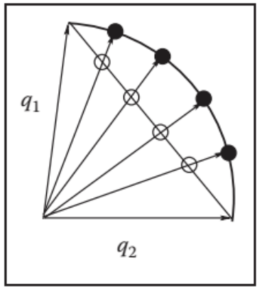

### T/F
- (T) Any orientation expressed as a quaternion can be expressed using Euler angles.
- (T) An Euler angle representation of an orientation uses less data than a quaternion representation.
- (F) The three axes used for the Euler angle representation must be unique. For example, using the X axis, then the Y axis and then the X axis would not work.
- (T) Changing the order of rotation can affect the result. For example, switching from an XYZ order to a YXZ order may change the orientation even if the three angles remain the same.

# Game Physics

## Simple Physics Engine

### The Timestep
How does the timestep effect the accuracy of the engine?
How would you see that error in a game?
Timestep in games uses wall-clock time (sometimes a scaled version)
- Also related to framerate

If the physics timestep is tied to the framerate, what can happen?

### UE Substepping
In UE look at Project Settings > Engine > Physics
- Substepping creates a degree of framerate independence for physics
- When framerate drops, Unreal will add extra physics iterations
- Physics timestep will not exceed the max delta time

## Collision Detection

### Bounding Volumes
AABB=Axis Aligned Bounding Box 
OOBB = Object-Oriented Bounding Box 
BVH = Bounding Volume Hierarchy

### BVH Construction
Can be constructed top down:
1. Compute bounding volume enclosing all of the geometry
2. Split the geometry into two or more groups
3. Compute bounding volume for each group
4. Recurse
5. Leaf nodes will enclose only one geometric primitive

#### BVH: Howto Split
- Can compute a centroid for each geometric primitive
    - Split on median centroid, along longest axis
    - Split on average centroid, along longest axis
- More sophisticated splitting criteria can be used
    - E.g. Surface Area Heuristic used on BVHs for ray-tracing

#### BVH: Howto Collide
- In a single BVH for scene
    - Two geometric primitives can overlap only if their volumes overlap

- Or, BVHs can be used for each composite object (e.g. mesh)
    - A search tree is constructed that records descent into each BVH
    - Determines if any cells overlap

# Introduction to Ray Tracing

# Rendering
## UE 5 Lumen
### Global Illumination
>“Global illumination…is a group of algorithms used in 3D computer graphics that are meant to add more realistic lighting to 3D scenes. Such algorithms take into account not only the light that comes directly from a light source (direct illumination), but also subsequent cases in which light rays from the same source are reflected by other surfaces in the scene, whether reflective or not (indirect illumination).
Theoretically, reflections, refractions, and shadows are all examples of global illumination, because when simulating them, one object affects the rendering of another (as opposed to an object being affected only by a direct source of light). In practice, however, only the simulation of diffuse inter-reflection or caustics is called global illumination.*” -- Wikipedia

### Lumen
Lumen is Unreal Engine 5's fully dynamic global illumination and reflections system
- Enabled out of the box. 
- Designed for next-generation consoles
- Supports high-end visualizations like architectural visualization
>“Lumen uses multiple ray-tracing methods to solve Global Illumination and Reflections. 
Screen Traces are done first, followed by a more reliable method. Lumen uses Software Ray Tracing through Signed Distance Fields by default, but can achieve higher quality on supporting video cards when Hardware Ray Tracing is enabled.”

# Game AI
## Tactical Waypoints
### Tactical and Strategic AI
Previously discuss pathfinding and decision making 
- A*
- Decision trees

Limitations
- Intended for use by a single character (no intelligent coordination between characters)
- Lack ability predict strategic or “big picture” outcomes
- Poor utilization of environment to tactical advantage

Tactical and strategic AI try to overcome these limitations
- Not needed in some game genres e.g. platformers or simple shooters

### Tactical Waypoints
- Waypoint is a position in a game level used in pathfinding at intermediate nodes along a route
- Can use waypoints for other kind of decision making
    - Can add data indicating special tactical features
    - Sometimes called “rally points”
    - Examples…
        - Safe spot designated for troops to retreat to…
        - Cover points or sniper positions
        - Heavily shadowed areas

# Game Design
## High-Level Design Process
- Designing from a high-level vision

- Analogous to other industries
    - User types
    - User experiences
    - Systems first then features

- Getting better at the process
    - We are a young industry
        - Rockstar
        - Ubisoft

## Principles of Design: 
### Starting Points
Design is an exercise in constraints
- Technical
- Narrative/World
- Time/Resources/Scope

Player Choice as a key constraint 
- Some games offer little choice (the designer experience)
- Others are more-wide open

Make sure you understand the project requirements
- Saints Row 3 and the over-developed missions/Co-op
- Processes can be constraints
    - “Fail Fast”

All apps/games start with an IDEA
There is so much more to what you want to build
The primary role of a designer is to clearly communicate how that IDEA fits into an App/Game (the bigger picture, the Vision)
What happens without that clarity? 
- Confusion
- Delay
- People building to their own vs. the required standards 

The question is: what focuses the design, what drives the definition of the Vision?

Once you have an idea, set a genre and then build a world around it
- Provides Context

- Provides Consistency

- Expand upon the idea to provide depth
    - An idea is a feature in most cases, a feature is not a game
    - Why is the world the way it is? Leads to new complementary ideas
    - Examples: Renegade and Red Faction Guerrilla

- Improve Immersion/Presence
    - Most games are Skill Challenges
    - Skill develops over time, the world encourages retention
    - Interactivity can add another layer

Player Types: These define the core interests of the user we are targeting with our features.
Example: Minecraft
- The Collector: 
    - This user requires the opportunity to gather items and build a large stockpile of items. 
    - The Builder:This user type enjoys creating different imaginative items from the resources available.

Define your User Experience(s): 
- The different emotional responses we are trying to elicit with our app/game features 
- Example: We want the gamer to be in awe when they face the challenges of our world.

## MDA
Mechanics: The rules and concepts that formally specify the game-as-system.
Dynamics: The run-time behavior of the game-as-system.
Aesthetics: The desirable emotional responses evoked by the game dynamics.

### 8 Kinds of Fun
1. Sensation: Game as sense-pleasure
Games that evoke emotion in the player through sound, visuals, controller rumble or physical effort.
2. Fantasy: Game as make-believe
Game as a mean to take the player to another world, some call it escapism. 
3. Narrative: Game as drama
Game as a mean to tell a story or narrative to the player.
4. Challenge: Game as obstacle course
Games that provide the player(s) with highly competitive value or with increasingly difficult challenges.
5. Fellowship: Game as social framework
Games that have social interactions as its core or as a big feature.
6. Discovery: Game as uncharted territory
Games in which the player explores the world he/she finds himself/herself in.
7. Expression: Game as self-discovery
Games that allow for self-expression from the player through gameplay.
8. Masochism: Game as submission
Games that have "farming" or "grinding" as a core element5. Fellowship: Game as social framework

# Reference:
[https://illinois-cs415.github.io](https://illinois-cs415.github.io) -->
