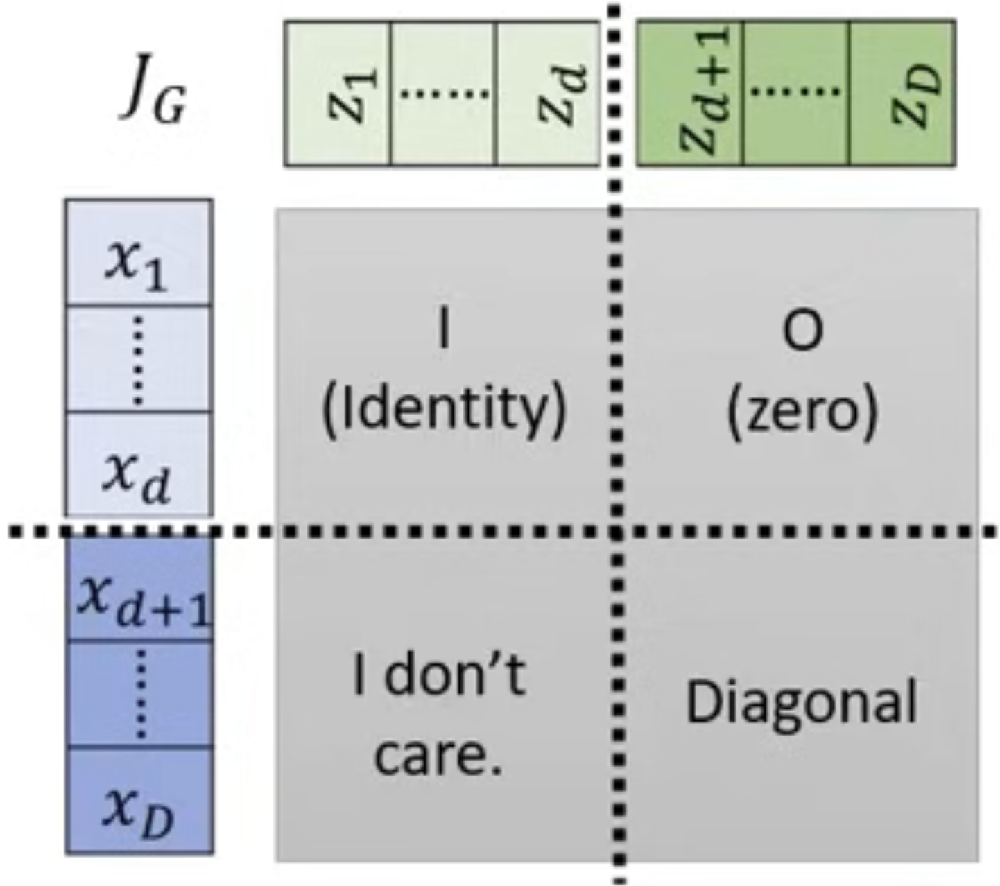
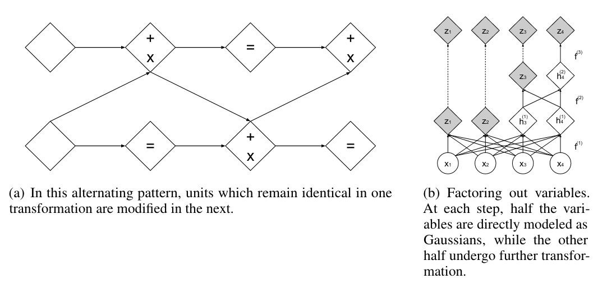
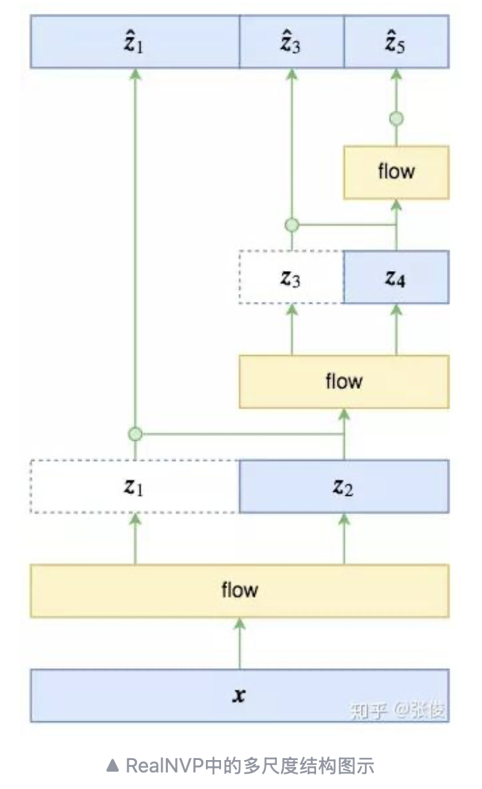
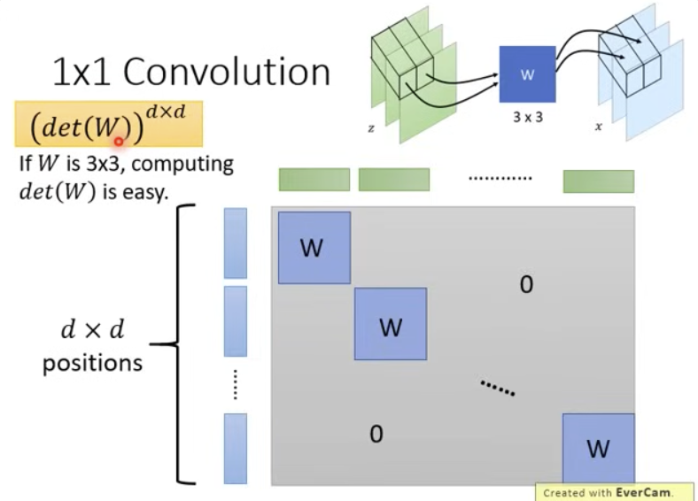

# Normalizing Flows

## Introduction to Generative Models

Main types of generative models:

- Autoregressive models  
- Variational Autoencoders (VAE)  
- Generative Adversarial Networks (GAN)

Issues:

- Autoregressive models are slow because they generate elements sequentially.  
- VAEs optimize ELBO instead of true likelihood.  
- GANs are powerful but unstable and less effective for tasks like speech generation.

Reference: https://www.youtube.com/watch?v=uXY18nzdSsM

## Flow-based Models

Flow-based models optimize the log-likelihood of data $p_G(x)$ transformed from a Gaussian distribution $\pi(z)$:

$$ z \rightarrow G \rightarrow x $$

Objective:

$$ G^* = \arg\max_{G} \sum_{i=1}^{m} \log p_G(x^i) $$

Equivalent to minimizing:

$$ \arg\min_G \sum_{i}^{m} D_{KL}(p_{\text{data}} \| p_G) $$

Flow-based models directly optimize log-likelihood.

## Timeline

2014 — NICE  
2016 — RealNVP  
2018 — Glow  

## Jacobian Matrix

Given:

$$
\mathbf{x} = f(\mathbf{z}), \quad
\mathbf{z} = \begin{bmatrix} z_1 \\ z_2 \end{bmatrix}, \quad
\mathbf{x} = \begin{bmatrix} x_1 \\ x_2 \end{bmatrix}
$$

Jacobian:

$$
J_f =
\begin{bmatrix}
\frac{\partial x_1}{\partial z_1} & \frac{\partial x_1}{\partial z_2} \\
\frac{\partial x_2}{\partial z_1} & \frac{\partial x_2}{\partial z_2}
\end{bmatrix}
$$

Inverse Jacobian:

$$
J_{f^{-1}} =
\begin{bmatrix}
\frac{\partial z_1}{\partial x_1} & \frac{\partial z_1}{\partial x_2} \\
\frac{\partial z_2}{\partial x_1} & \frac{\partial z_2}{\partial x_2}
\end{bmatrix}
$$

Relationship:

$$
J_{f^{-1}} \cdot J_f = I
$$

## Determinant of Jacobian

For an invertible matrix $A$:

$$
\det(A^{-1}) = \frac{1}{\det(A)}
$$

Thus:

$$
\det(J_{f^{-1}}) = \frac{1}{\det(J_f)}
$$

Important for computing likelihood via change of variables.

## Change of Variable Theorem

If $\mathbf{x} = f(\mathbf{z})$:

$$
p(\mathbf{x}) |\det(J_f)| = \pi(\mathbf{z})
$$

Thus:

$$
p(\mathbf{x}) = \pi(\mathbf{z}) |\det(J_{f^{-1}})|
$$

### 2D Illustration

Picking a small square in $\mathbf{z}$ mapped to a deformed region in $\mathbf{x}$ gives:

$$
\pi(\mathbf{z}') =
p(\mathbf{x}')
\left|
\det \begin{bmatrix}
\frac{\partial x_1}{\partial z_1} &
\frac{\partial x_1}{\partial z_2} \\
\frac{\partial x_2}{\partial z_1} &
\frac{\partial x_2}{\partial z_2}
\end{bmatrix}
\right|
$$

Thus:

$$
\pi(\mathbf{z}') = p(\mathbf{x}') |\det(J_f)|
$$

## New Objective

Using:

$$
p_G(x) = \pi(G^{-1}(x)) |\det(J_{G^{-1}})|
$$

We obtain:

$$
G^* =
\arg\max_G
\sum_{i=1}^m
\left[
\log \pi(G^{-1}(x^i))
+
\log |\det(J_{G^{-1}})|
\right]
$$

## Why Coupling Layers

Problems:

1. High-dimensional Jacobians make determinants expensive.  
2. Training requires $G^{-1}$, so $G$ must be invertible and dimension-preserving.  
3. Need multiple invertible transformations → flows.

## Coupling Layers

We apply a sequence of invertible transformations:

$$
z^i = G_1^{-1}(G_2^{-1}(\cdots G_K^{-1}(x^i)))
$$

Density:

$$
p_K(x^i) =
\pi(z^i)
\prod_{h=1}^{K}
|\det(J_{G_h^{-1}})|
$$

Log density:

$$
\log p_K(x^i)
=
\log \pi(z^i)
+
\sum_{h=1}^{K}
\log|\det(J_{G_h^{-1}})|
$$

During training we optimize $G^{-1}$ but use $G$ for generation.

## Affine Coupling Layer

To compute $G^{-1}$:

$$
z_{i \le d} = x_i,
\quad
z_{i > d} = \frac{x_i - \gamma_i}{\beta_i}
$$

Determinant:

$$
\det(J_G)
=
\prod_{i=d+1}^{D} \beta_i
$$

Image:  

Determinant intuition:  

## Masking

Two masking strategies:

1. Checkerboard mask  
2. Channel-wise masking (using squeezing to increase channels)

## Composition of Coupling Layers

## Multi-scale Architecture

Example structure:

- Variables at different scales are not equivalent  
- Factorization:

$$
p(z_1, z_3, z_5)
= p(z_1|z_3,z_5)p(z_3|z_5)p(z_5)
$$

Standardization:

$$
\hat{z}_1 = \frac{z_1 - \mu(z_2)}{\sigma(z_2)}
$$

Image:  

## GLOW

Glow architecture:

Glow properties:

## Convolution as Invertible Transform

Channel mixing with invertible $3 \times 3$ matrix $W$:

$$
x = Wz
$$

If $W$ is invertible:

$$
J_f = W
$$

Image:  

## Results

See OpenAI Glow results: https://openai.com/index/glow/

  

---
